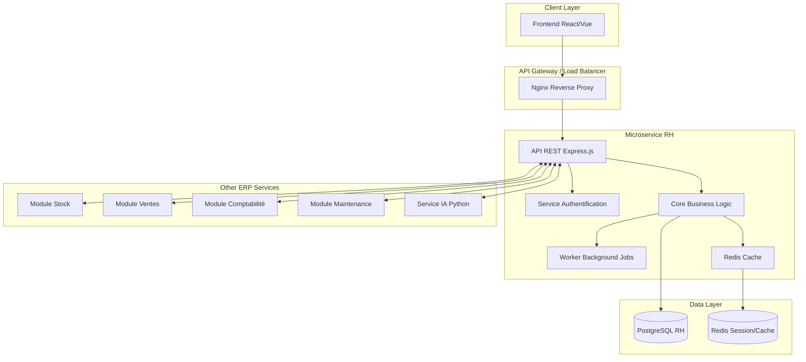
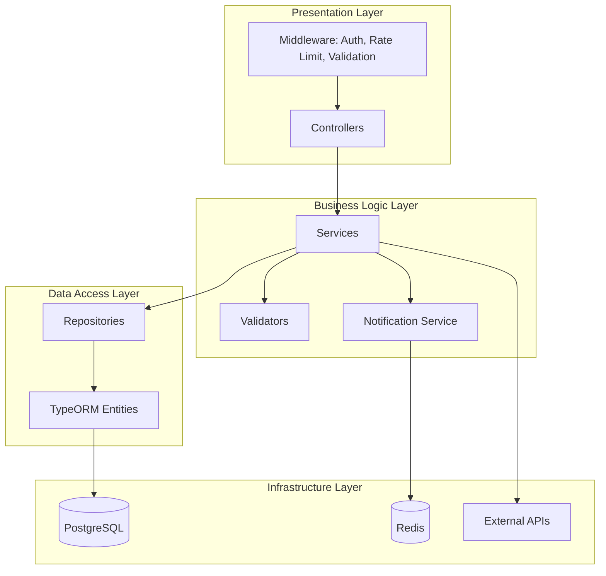
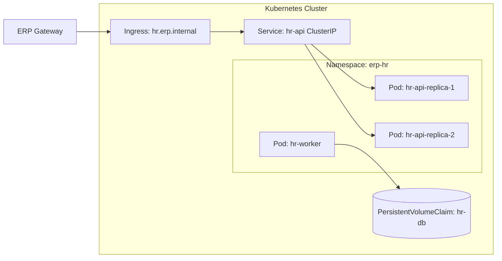
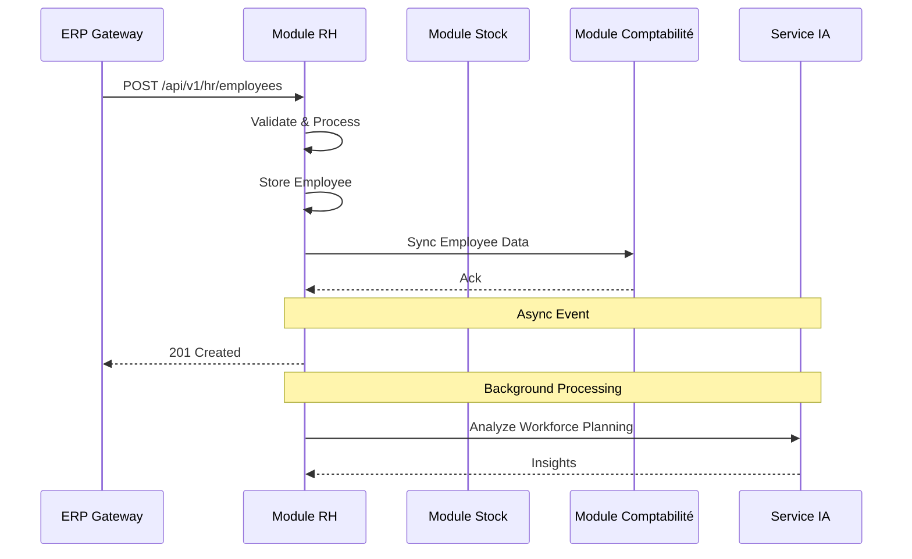
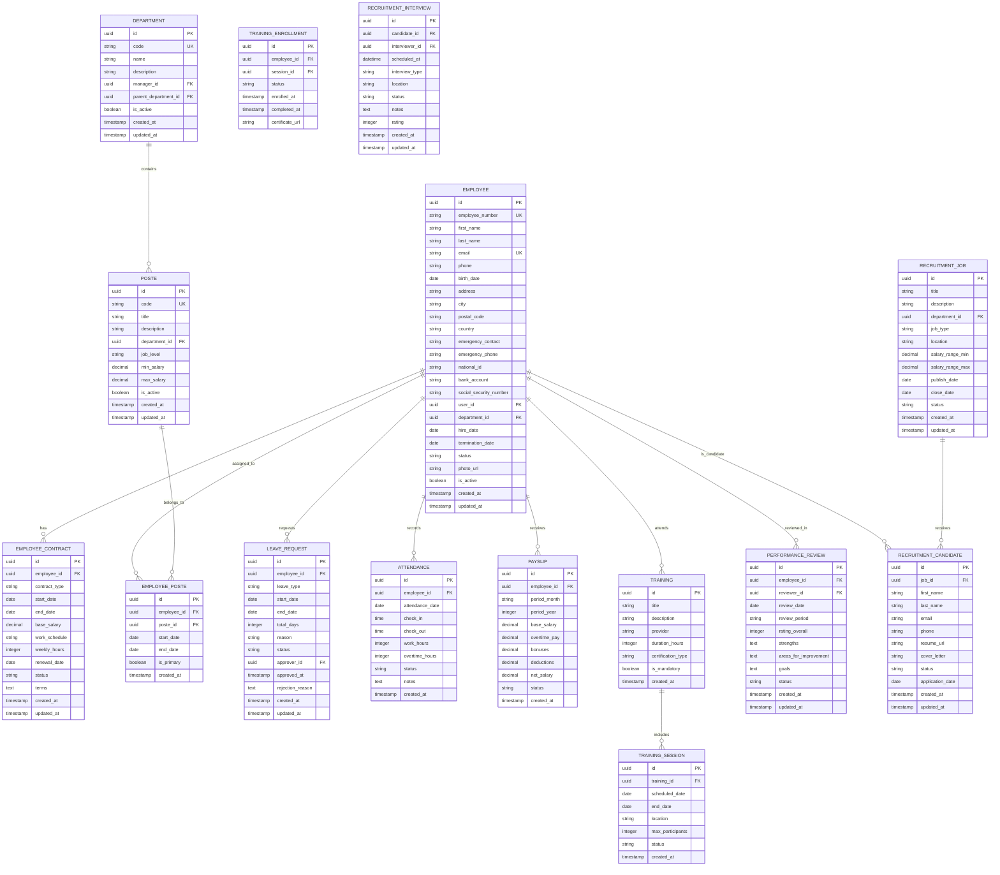
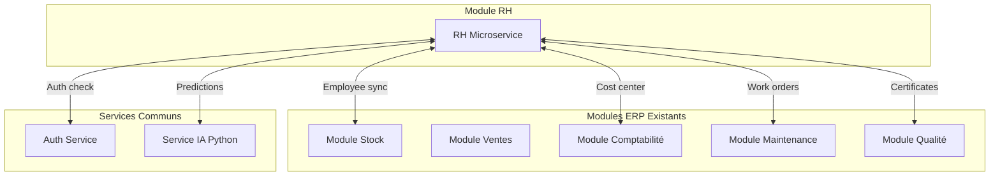

# Module RH - Spécification Technique Complète

## Table des Matières

1. [Architecture Technique du Microservice RH](#1-architecture-technique-du-microservice-rh)
2. [Schéma de Base de Données](#2-schema-de-base-de-donnees)
3. [Endpoints API REST](#3-endpoints-api-rest)
4. [Structure de Projet](#4-structure-de-projet)
5. [Intégration avec les Autres Modules ERP](#5-integration-avec-les-autres-modules-erp)
6. [Technologies Recommandées](#6-technologies-recommandees)
7. [Exemples de Code Critiques](#7-exemples-de-code-critiques)

---

## 1. Architecture Technique du Microservice RH

### 1.1 Vue d'Ensemble de l'Architecture

Le module RH sera conçu comme un microservice Node.js autonome, déployable indépendamment et communicant avec les autres services de l'ERP via des API REST. Cette architecture permet une scalabilité horizontale, une maintenance facilitée et une isolation des données RH sensibles.



### 1.2 Architecture Interne du Microservice

L'architecture interne du microservice RH adopte le pattern Controller-Service-Repository avec une séparation claire des responsabilités.



### 1.3 Modèle de Déploiement

Le microservice RH sera déployé dans un conteneur Docker, permettant une orchestration via Kubernetes pour la scalabilité et la haute disponibilité.



### 1.4 Flux de Communication Inter-Services

La communication synchrone utilise des API REST avec timeout et retry, tandis que la communication asynchrone utilise des files de messages RabbitMQ ou Redis pour les événements non bloquants.



---

## 2. Schéma de Base de Données

### 2.1 Diagramme Entité-Relation

Le schéma de base de données du module RH contient les entités suivantes, organisées pour gérer l'ensemble des fonctionnalités RH demandées.



### 2.2 Détail des Tables

Les sections suivantes décrivent chaque table en détail avec ses colonnes, types et contraintes.

#### 2.2.1 Table: employees

La table centrale du module RH, contenant toutes les informations personnelles et professionnelles des employés.

| Colonne | Type | Contrainte | Description |
|---------|------|------------|-------------|
| id | UUID | PK | Identifiant unique |
| employee_number | VARCHAR(20) | UNIQUE, NOT NULL | Numéro d'employé (format: EMP-YYYY-XXXX) |
| first_name | VARCHAR(100) | NOT NULL | Prénom |
| last_name | VARCHAR(100) | NOT NULL | Nom de famille |
| email | VARCHAR(255) | UNIQUE, NOT NULL | Email professionnel |
| phone | VARCHAR(20) | NULL | Téléphone |
| birth_date | DATE | NULL | Date de naissance |
| address | VARCHAR(255) | NULL | Adresse |
| city | VARCHAR(100) | NULL | Ville |
| postal_code | VARCHAR(20) | NULL | Code postal |
| country | VARCHAR(100) | DEFAULT 'France' | Pays |
| emergency_contact | VARCHAR(200) | NULL | Contact d'urgence |
| emergency_phone | VARCHAR(20) | NULL | Téléphone d'urgence |
| national_id | VARCHAR(50) | NULL | Numéro CIN/Passeport |
| bank_account | VARCHAR(255) | NULL | IBAN |
| social_security_number | VARCHAR(50) | NULL | Numéro de sécurité sociale |
| user_id | UUID | FK -> users | Lien vers compte utilisateur ERP |
| department_id | UUID | FK -> departments | Département actuel |
| hire_date | DATE | NOT NULL | Date d'embauche |
| termination_date | DATE | NULL | Date de fin de contrat |
| status | ENUM | NOT NULL | Statut (ACTIVE, INACTIVE, TERMINATED, ON_LEAVE) |
| photo_url | VARCHAR(500) | NULL | URL photo profil |
| is_active | BOOLEAN | DEFAULT TRUE | Active/Inactif |
| created_at | TIMESTAMP | NOT NULL | Date de création |
| updated_at | TIMESTAMP | NOT NULL | Date de modification |

#### 2.2.2 Table: departments

Structuration hiérarchique de l'entreprise en départements.

| Colonne | Type | Contrainte | Description |
|---------|------|------------|-------------|
| id | UUID | PK | Identifiant unique |
| code | VARCHAR(20) | UNIQUE, NOT NULL | Code département (ex: RH, PROD, FIN) |
| name | VARCHAR(100) | NOT NULL | Nom |
| description | TEXT | NULL | Description |
| manager_id | UUID | FK -> employees | Responsable du département |
| parent_department_id | UUID | FK -> departments | Déparentement parent |
| is_active | BOOLEAN | DEFAULT TRUE | Active/Inactif |
| created_at | TIMESTAMP | NOT NULL | Date de création |
| updated_at | TIMESTAMP | NOT NULL | Date de modification |

#### 2.2.3 Table: postes

Définition des postes disponibles dans l'entreprise.

| Colonne | Type | Contrainte | Description |
|---------|------|------------|-------------|
| id | UUID | PK | Identifiant unique |
| code | VARCHAR(20) | UNIQUE, NOT NULL | Code poste |
| title | VARCHAR(100) | NOT NULL | Intitulé du poste |
| description | TEXT | NULL | Description |
| department_id | UUID | FK -> departments | Département |
| job_level | VARCHAR(50) | NULL | Niveau (Junior, Senior, Manager, etc.) |
| min_salary | DECIMAL(12,2) | NULL | Salaire minimum |
| max_salary | DECIMAL(12,2) | NULL | Salaire maximum |
| is_active | BOOLEAN | DEFAULT TRUE | Active/Inactif |
| created_at | TIMESTAMP | NOT NULL | Date de création |
| updated_at | TIMESTAMP | NOT NULL | Date de modification |

#### 2.2.4 Table: employee_contracts

Gestion des contrats de travail.

| Colonne | Type | Contrainte | Description |
|---------|------|------------|-------------|
| id | UUID | PK | Identifiant unique |
| employee_id | UUID | FK -> employees, NOT NULL | Employé |
| contract_type | ENUM | NOT NULL | Type (CDI, CDD, STAGE, APPRENTICE, INTERIM) |
| start_date | DATE | NOT NULL | Date de début |
| end_date | DATE | NULL | Date de fin (pour CDD) |
| base_salary | DECIMAL(12,2) | NOT NULL | Salaire de base |
| work_schedule | VARCHAR(50) | NULL | Horaire (35h, 40h, etc.) |
| weekly_hours | INTEGER | NOT NULL | Heures hebdomadaires |
| renewal_date | DATE | NULL | Date de renouvellement |
| status | ENUM | NOT NULL | Statut (ACTIVE, EXPIRED, TERMINATED) |
| terms | TEXT | NULL | Conditions spécifiques |
| created_at | TIMESTAMP | NOT NULL | Date de création |
| updated_at | TIMESTAMP | NOT NULL | Date de modification |

#### 2.2.5 Table: leave_requests

Suivi des demandes de congés.

| Colonne | Type | Contrainte | Description |
|---------|------|------------|-------------|
| id | UUID | PK | Identifiant unique |
| employee_id | UUID | FK -> employees, NOT NULL | Employé |
| leave_type | ENUM | NOT NULL | Type (ANNUAL, SICK, MATERNITY, PATERNITY, UNPAID, OTHER) |
| start_date | DATE | NOT NULL | Date de début |
| end_date | DATE | NOT NULL | Date de fin |
| total_days | DECIMAL(3,1) | NOT NULL | Nombre de jours |
| reason | TEXT | NULL | Motif |
| status | ENUM | NOT NULL | Statut (PENDING, APPROVED, REJECTED, CANCELLED) |
| approver_id | UUID | FK -> employees | Approbateur |
| approved_at | TIMESTAMP | NULL | Date d'approbation |
| rejection_reason | TEXT | NULL | Motif de rejet |
| created_at | TIMESTAMP | NOT NULL | Date de création |
| updated_at | TIMESTAMP | NOT NULL | Date de modification |

#### 2.2.6 Table: attendances

Suivi quotidien des présences et pointages.

| Colonne | Type | Contrainte | Description |
|---------|------|------------|-------------|
| id | UUID | PK | Identifiant unique |
| employee_id | UUID | FK -> employees, NOT NULL | Employé |
| attendance_date | DATE | NOT NULL | Date |
| check_in | TIME | NULL | Heure d'arrivée |
| check_out | TIME | NULL | Heure de départ |
| work_hours | DECIMAL(5,2) | NULL | Heures travaillées |
| overtime_hours | DECIMAL(5,2) | NULL | Heures supplémentaires |
| status | ENUM | NOT NULL | Statut (PRESENT, ABSENT, LATE, ON_LEAVE) |
| notes | TEXT | NULL | Notes |
| created_at | TIMESTAMP | NOT NULL | Date de création |

#### 2.2.7 Table: payslips

Bulletins de paie générés mensuellement.

| Colonne | Type | Contrainte | Description |
|---------|------|------------|-------------|
| id | UUID | PK | Identifiant unique |
| employee_id | UUID | FK -> employees, NOT NULL | Employé |
| period_month | INTEGER | NOT NULL | Mois (1-12) |
| period_year | INTEGER | NOT NULL | Année |
| base_salary | DECIMAL(12,2) | NOT NULL | Salaire de base |
| overtime_pay | DECIMAL(12,2) | DEFAULT 0 | Heures supplémentaires |
| bonuses | DECIMAL(12,2) | DEFAULT 0 | Primes |
| deductions | DECIMAL(12,2) | DEFAULT 0 | Déductions |
| net_salary | DECIMAL(12,2) | NOT NULL | Salaire net |
| status | ENUM | NOT NULL | Statut (DRAFT, VALIDATED, PAID) |
| created_at | TIMESTAMP | NOT NULL | Date de création |

#### 2.2.8 Table: trainings

Catalogue des formations disponibles.

| Colonne | Type | Contrainte | Description |
|---------|------|------------|-------------|
| id | UUID | PK | Identifiant unique |
| title | VARCHAR(200) | NOT NULL | Titre |
| description | TEXT | NULL | Description |
| provider | VARCHAR(200) | NULL | Organisme |
| duration_hours | INTEGER | NULL | Durée (heures) |
| certification_type | VARCHAR(100) | NULL | Type certification |
| is_mandatory | BOOLEAN | DEFAULT FALSE | Formation obligatoire |
| created_at | TIMESTAMP | NOT NULL | Date de création |

#### 2.2.9 Table: performance_reviews

Évaluations des performances des employés.

| Colonne | Type | Contrainte | Description |
|---------|------|------------|-------------|
| id | UUID | PK | Identifiant unique |
| employee_id | UUID | FK -> employees, NOT NULL | Employé évalué |
| reviewer_id | UUID | FK -> employees | Évaluateur |
| review_date | DATE | NOT NULL | Date de l'évaluation |
| review_period | VARCHAR(50) | NULL | Période (ex: Q1 2024) |
| rating_overall | INTEGER | NULL | Note globale (1-5) |
| strengths | TEXT | NULL | Points forts |
| areas_for_improvement | TEXT | NULL | Points à améliorer |
| goals | TEXT | NULL | Objectifs |
| status | ENUM | NOT NULL | Statut (DRAFT, SUBMITTED, COMPLETED) |
| created_at | TIMESTAMP | NOT NULL | Date de création |
| updated_at | TIMESTAMP | NOT NULL | Date de modification |

#### 2.2.10 Table: recruitment_jobs

Offres d'emploi à pourvoir.

| Colonne | Type | Contrainte | Description |
|---------|------|------------|-------------|
| id | UUID | PK | Identifiant unique |
| title | VARCHAR(200) | NOT NULL | Titre du poste |
| description | TEXT | NOT NULL | Description |
| department_id | UUID | FK -> departments | Département |
| job_type | VARCHAR(50) | NULL | Type (CDI, CDD, Stage) |
| location | VARCHAR(100) | NULL | Lieu |
| salary_range_min | DECIMAL(12,2) | NULL | Salaire min |
| salary_range_max | DECIMAL(12,2) | NULL | Salaire max |
| publish_date | DATE | NULL | Date de publication |
| close_date | DATE | NULL | Date de clôture |
| status | ENUM | NOT NULL | Statut (DRAFT, OPEN, CLOSED, CANCELLED) |
| created_at | TIMESTAMP | NOT NULL | Date de création |
| updated_at | TIMESTAMP | NOT NULL | Date de modification |

#### 2.2.11 Table: recruitment_candidates

Candidatures reçues.

| Colonne | Type | Contrainte | Description |
|---------|------|------------|-------------|
| id | UUID | PK | Identifiant unique |
| job_id | UUID | FK -> recruitment_jobs | Poste concerné |
| first_name | VARCHAR(100) | NOT NULL | Prénom |
| last_name | VARCHAR(100) | NOT NULL | Nom |
| email | VARCHAR(255) | NOT NULL | Email |
| phone | VARCHAR(20) | NULL | Téléphone |
| resume_url | VARCHAR(500) | NULL | URL CV |
| cover_letter | TEXT | NULL | Lettre de motivation |
| status | ENUM | NOT NULL | Statut (APPLIED, SCREENING, INTERVIEW, OFFER, HIRED, REJECTED) |
| application_date | DATE | NOT NULL | Date de candidature |
| created_at | TIMESTAMP | NOT NULL | Date de création |
| updated_at | TIMESTAMP | NOT NULL | Date de modification |

---

## 3. Endpoints API REST

### 3.1 Convention d'API

Toutes les API suivent les conventions REST avec les caractéristiques suivantes:

- Format: JSON
- Authentication: Bearer Token (JWT)
- Versioning: URL path /api/v1/hr/
- Pagination: Query params page, limit
- Filtrage: Query params filter, sort

### 3.2 Gestion des Employés

Endpoints pour la création, lecture, mise à jour et archivage des fiches employés.

| Méthode | Endpoint | Description | Permissions |
|---------|----------|-------------|-------------|
| GET | /api/v1/hr/employees | Liste paginée des employés | rh:read, admin:read |
| GET | /api/v1/hr/employees/:id | Détails d'un employé | rh:read, admin:read |
| POST | /api/v1/hr/employees | Créer un nouvel employé | rh:create, admin:create |
| PUT | /api/v1/hr/employees/:id | Modifier un employé | rh:update, admin:update |
| DELETE | /api/v1/hr/employees/:id | Archiver un employé | rh:delete, admin:delete |
| GET | /api/v1/hr/employees/:id/contracts | Contrats de l'employé | rh:read |
| GET | /api/v1/hr/employees/:id/attendance | Présences de l'employé | rh:read, self |
| GET | /api/v1/hr/employees/:id/payslips | Bulletins de paie | rh:read, self |
| GET | /api/v1/hr/employees/:id/reviews | Évaluations | rh:read, self |

### 3.3 Gestion des Départements et Postes

| Méthode | Endpoint | Description | Permissions |
|---------|----------|-------------|-------------|
| GET | /api/v1/hr/departments | Liste des départements | all:read |
| POST | /api/v1/hr/departments | Créer un département | admin:create |
| PUT | /api/v1/hr/departments/:id | Modifier un département | admin:update |
| DELETE | /api/v1/hr/departments/:id | Supprimer un département | admin:delete |
| GET | /api/v1/hr/postes | Liste des postes | all:read |
| POST | /api/v1/hr/postes | Créer un poste | rh:create |
| PUT | /api/v1/hr/postes/:id | Modifier un poste | rh:update |
| DELETE | /api/v1/hr/postes/:id | Supprimer un poste | rh:delete |

### 3.4 Gestion des Contrats

| Méthode | Endpoint | Description | Permissions |
|---------|----------|-------------|-------------|
| GET | /api/v1/hr/contracts | Liste des contrats | rh:read |
| GET | /api/v1/hr/contracts/:id | Détails d'un contrat | rh:read |
| POST | /api/v1/hr/contracts | Créer un contrat | rh:create |
| PUT | /api/v1/hr/contracts/:id | Modifier un contrat | rh:update |
| POST | /api/v1/hr/contracts/:id/renew | Renouveler un contrat | rh:update |
| POST | /api/v1/hr/contracts/:id/terminate | Terminer un contrat | rh:update |

### 3.5 Gestion des Congés et Absences

| Méthode | Endpoint | Description | Permissions |
|---------|----------|-------------|-------------|
| GET | /api/v1/hr/leave-requests | Liste des demandes | rh:read |
| GET | /api/v1/hr/leave-requests/:id | Détails d'une demande | rh:read |
| POST | /api/v1/hr/leave-requests | Soumettre une demande | self:create |
| PUT | /api/v1/hr/leave-requests/:id | Modifier sa demande | self:update |
| PUT | /api/v1/hr/leave-requests/:id/approve | Approuver | rh:approve |
| PUT | /api/v1/hr/leave-requests/:id/reject | Rejeter | rh:approve |
| DELETE | /api/v1/hr/leave-requests/:id | Annuler sa demande | self:delete |
| GET | /api/v1/hr/leave-balances | Soldes de congés | self:read, rh:read |

### 3.6 Gestion des Présences

| Méthode | Endpoint | Description | Permissions |
|---------|----------|-------------|-------------|
| GET | /api/v1/hr/attendances | Liste des pointages | rh:read |
| POST | /api/v1/hr/attendances/check-in | Pointer l'arrivée | self:create |
| POST | /api/v1/hr/attendances/check-out | Pointer le départ | self:create |
| GET | /api/v1/hr/attendances/report | Rapport de présence | rh:read |
| GET | /api/v1/hr/overtime | Heures supplémentaires | rh:read |

### 3.7 Gestion de la Paie

| Méthode | Endpoint | Description | Permissions |
|---------|----------|-------------|-------------|
| GET | /api/v1/hr/payslips | Liste des bulletins | rh:read, self |
| GET | /api/v1/hr/payslips/:id | Détails d'un bulletin | rh:read, self |
| POST | /api/v1/hr/payslips/generate | Générer les bulletins | rh:create |
| PUT | /api/v1/hr/payslips/:id/validate | Valider un bulletin | compta:validate |
| POST | /api/v1/hr/payslips/:id/export | Exporter bulletin PDF | rh:read |
| GET | /api/v1/hr/salary-history | Historique salarial | rh:read |

### 3.8 Gestion des Formations

| Méthode | Endpoint | Description | Permissions |
|---------|----------|-------------|-------------|
| GET | /api/v1/hr/trainings | Catalogue des formations | all:read |
| POST | /api/v1/hr/trainings | Créer une formation | rh:create |
| PUT | /api/v1/hr/trainings/:id | Modifier une formation | rh:update |
| DELETE | /api/v1/hr/trainings/:id | Supprimer une formation | rh:delete |
| GET | /api/v1/hr/training-sessions | Sessions de formation | all:read |
| POST | /api/v1/hr/training-sessions | Créer une session | rh:create |
| POST | /api/v1/hr/training-enrollments | Inscrire un employé | rh:create |
| GET | /api/v1/hr/training-enrollments | Liste des inscriptions | rh:read |

### 3.9 Évaluation des Performances

| Méthode | Endpoint | Description | Permissions |
|---------|----------|-------------|-------------|
| GET | /api/v1/hr/reviews | Liste des évaluations | rh:read |
| GET | /api/v1/hr/reviews/:id | Détails d'une évaluation | rh:read |
| POST | /api/v1/hr/reviews | Créer une évaluation | rh:create |
| PUT | /api/v1/hr/reviews/:id | Modifier l'évaluation | rh:update |
| POST | /api/v1/hr/reviews/:id/submit | Soumettre l'évaluation | rh:update |
| GET | /api/v1/hr/reviews/cycles | Cycles d'évaluation | rh:read |

### 3.10 Gestion des Recrutements

| Méthode | Endpoint | Description | Permissions |
|---------|----------|-------------|-------------|
| GET | /api/v1/hr/jobs | Liste des offres | all:read |
| POST | /api/v1/hr/jobs | Publier une offre | rh:create |
| PUT | /api/v1/hr/jobs/:id | Modifier une offre | rh:update |
| DELETE | /api/v1/hr/jobs/:id | Clôre une offre | rh:delete |
| GET | /api/v1/hr/candidates | Liste des candidats | rh:read |
| POST | /api/v1/hr/candidates | Ajouter un candidat | rh:create |
| PUT | /api/v1/hr/candidates/:id/status | Changer statut | rh:update |
| GET | /api/v1/hr/interviews | Liste des entretiens | rh:read |
| POST | /api/v1/hr/interviews | Planifier un entretien | rh:create |
| PUT | /api/v1/hr/interviews/:id | Modifier l'entretien | rh:update |

### 3.11 Rapports et Tableaux de Bord

| Méthode | Endpoint | Description | Permissions |
|---------|----------|-------------|-------------|
| GET | /api/v1/hr/dashboard/stats | Statistiques RH | rh:read |
| GET | /api/v1/hr/reports/headcount | Effectif par département | rh:read |
| GET | /api/v1/hr/reports/turnover | Taux de rotation | rh:read |
| GET | /api/v1/hr/reports/absenteeism | Taux d'absentéisme | rh:read |
| GET | /api/v1/hr/reports/training | Rapport formations | rh:read |

---

## 4. Structure de Projet

### 4.1 Organisation des Répertoires

La structure de projet suit les meilleures pratiques Node.js avec une séparation claire des couches applicatives.

```
hr-microservice/
├── src/
│   ├── app.ts                      # Point d'entrée de l'application
│   ├── config/
│   │   ├── database.ts             # Configuration TypeORM
│   │   ├── redis.ts                # Configuration Redis
│   │   ├── email.ts                # Configuration email
│   │   ├── logger.ts               # Configuration Winston
│   │   └── swagger.ts              # Configuration Swagger
│   │
│   ├── modules/
│   │   ├── employees/
│   │   │   ├── controllers/
│   │   │   │   └── employee.controller.ts
│   │   │   ├── services/
│   │   │   │   ├── employee.service.ts
│   │   │   │   └── employee.validation.ts
│   │   │   ├── repositories/
│   │   │   │   └── employee.repository.ts
│   │   │   ├── routes/
│   │   │   │   └── employee.routes.ts
│   │   │   └── dto/
│   │   │       ├── create-employee.dto.ts
│   │   │       └── update-employee.dto.ts
│   │   │
│   │   ├── departments/
│   │   │   ├── controllers/
│   │   │   ├── services/
│   │   │   ├── repositories/
│   │   │   ├── routes/
│   │   │   └── dto/
│   │   │
│   │   ├── contracts/
│   │   ├── leave/
│   │   ├── attendance/
│   │   ├── payroll/
│   │   ├── training/
│   │   ├── performance/
│   │   └── recruitment/
│   │
│   ├── shared/
│   │   ├── entities/
│   │   │   └── base.entity.ts
│   │   ├── decorators/
│   │   │   ├── current-user.decorator.ts
│   │   │   └── roles.decorator.ts
│   │   ├── middlewares/
│   │   │   ├── auth.middleware.ts
│   │   │   ├── rbac.middleware.ts
│   │   │   └── validation.middleware.ts
│   │   ├── interceptors/
│   │   │   ├── logging.interceptor.ts
│   │   │   └── transform.interceptor.ts
│   │   └── utils/
│   │       ├── crypto.ts
│   │       ├── validators.ts
│   │       └── pdf-generator.ts
│   │
│   ├── integrations/
│   │   ├── erp-gateway/            # Communication avec autres modules
│   │   ├── stock-service.client.ts
│   │   ├── comptabilite-service.client.ts
│   │   └── ia-service.client.ts
│   │
│   ├── workers/
│   │   ├── payroll.worker.ts       # Génération mensuelle paie
│   │   ├── attendance.worker.ts    # Traitement des pointages
│   │   └── notification.worker.ts # Envoi notifications
│   │
│   └── migrations/                  # Migrations TypeORM
│
├── tests/
│   ├── unit/
│   ├── integration/
│   └── e2e/
│
├── docker/
│   ├── Dockerfile
│   └── docker-compose.yml
│
├── helm/
│   └── hr-module/
│       ├── Chart.yaml
│       ├── values.yaml
│       └── templates/
│
├── .env
├── .env.example
├── package.json
├── tsconfig.json
├── jest.config.js
└── README.md
```

### 4.2 Structure des Modules

Chaque module fonctionnel (employees, departments, etc.) suit la même structure interne, promoteur de la cohérence et de la maintenabilité.

```
module-name/
├── controllers/          # Gestion des requêtes HTTP
│   └── module.controller.ts
├── services/             # Logique métier
│   ├── module.service.ts
│   └── module.validation.ts
├── repositories/         # Accès données (optionnel avec TypeORM)
│   └── module.repository.ts
├── routes/               # Définition des routes Express
│   └── module.routes.ts
├── dto/                  # Data Transfer Objects
│   ├── create-module.dto.ts
│   ├── update-module.dto.ts
│   └── module-response.dto.ts
├── entities/            # Entités TypeORM
│   └── module.entity.ts
├── events/              # Événements domain Driven Design
│   └── module.events.ts
└── tests/
    ├── module.service.spec.ts
    └── module.controller.spec.ts
```

---

## 5. Intégration avec les Autres Modules ERP

### 5.1 Vue d'Ensemble de l'Intégration

Le module RH doit interagir avec plusieurs autres modules de l'ERP pour fonctionner correctement dans le contexte d'une entreprise industrielle.



### 5.2 Intégration avec le Module Stock

Le module RH communique avec le module stock pour synchroniser les informations sur les employés travaillant avec les stocks de matières premières et produits finis.

| Flux | Direction | Description |
|------|-----------|-------------|
| Employee Assignment | RH → Stock | Un employé est affecté à un atelier/entrepôt |
| Workforce Updates | RH → Stock | Mise à jour des équipes de production |
| Skills Sync | RH → Stock | Compétences certifiées pour manipulation de matériaux |

**Exemple de payload:**
```typescript
interface StockEmployeeSync {
  employeeId: string;
  employeeNumber: string;
  fullName: string;
  department: string;
  poste: string;
  isActive: boolean;
  certificationIds: string[];
  syncTimestamp: string;
}
```

### 5.3 Intégration avec le Module Comptabilité

L'intégration avec la comptabilité est critique pour la paie et la gestion des coûtssalariaux.

| Flux | Direction | Description |
|------|-----------|-------------|
| Payroll Data | RH → Comptabilité | Envoi des bulletins de paie pour comptabilisation |
| Cost Centers | RH → Comptabilité | Affectation des employés aux centres de coûts |
| Tax Declarations | RH → Comptabilité | Données pour les déclarations sociales |
| Expense Validation | RH → Comptabilité | Validation des notes de frais |

**API Endpoint:**
```
POST /api/v1/integrations/comptabilite/payslips
Content-Type: application/json
Authorization: Bearer {token}

{
  "payslipId": "uuid",
  "employeeId": "uuid",
  "period": "2024-01",
  "grossSalary": 3500.00,
  "netSalary": 2730.00,
  "employerContributions": 1200.00,
  "costCenter": "PROD-001"
}
```

### 5.4 Intégration avec le Module Maintenance

Les employés du service maintenance doivent être visibles dans le module RH pour la planification des interventions.

| Flux | Direction | Description |
|------|-----------|-------------|
| Technician List | RH → Maintenance | Synchronisation des techniciens |
| Work Order Assignment | Maintenance → RH | Affectation d'un employé à un ordre de travail |
| Skills Matrix | RH → Maintenance | Compétences techniques des employés |

### 5.5 Intégration avec le Service IA (Python)

Le service d'IA Python peut être utilisé pour des analyses prédictives sur la main-d'œuvre.

| Cas d'usage | Description |
|-------------|-------------|
| Workforce Planning | Prédiction des besoins en recrutement |
| Attrition Risk | Identification des employés à risque de départ |
| Skills Gap | Analyse des écarts de compétences |
| Performance Prediction | Prédiction des performances |

**Appel au service IA:**
```typescript
// hr-microservice/src/integrations/ia-service.client.ts
import axios from 'axios';

export class IAServiceClient {
  private baseUrl: string;
  
  constructor() {
    this.baseUrl = process.env.AI_SERVICE_URL || 'http://localhost:8000';
  }
  
  async predictAttritionRisk(employeeIds: string[]): Promise<AttritionPrediction[]> {
    const response = await axios.post(`${this.baseUrl}/api/hr/predict-attrition`, {
      employee_ids: employeeIds,
      features: ['tenure', 'salary', 'reviews', 'leave_balance']
    });
    return response.data.predictions;
  }
  
  async analyzeWorkforceTrends(): Promise<WorkforceInsights> {
    const response = await axios.get(`${this.baseUrl}/api/hr/workforce-insights`);
    return response.data;
  }
}
```

### 5.6 Authentication Partagée

Le module RH utilise le même système d'authentification que le reste de l'ERP mais avec sa propre base de données utilisateurs synchronisée.

```typescript
// Validation du token JWT par le service auth central
interface HRTokenPayload {
  userId: string;
  email: string;
  role: 'admin' | 'rh' | 'comptable' | 'user';
  permissions: string[];
  hrAccess: boolean;  // Accès spécifique au module RH
}
```

---

## 6. Technologies Recommandées

### 6.1 Stack Technologique Principale

Le module RH utilise les mêmes technologies que le backend ERP existant pour maintenir la cohérence.

| Catégorie | Technologie | Version | Justification |
|-----------|-------------|---------|---------------|
| Runtime | Node.js | 20 LTS | Compatible avec l'existant |
| Langage | TypeScript | 5.3+ | Type safety, maintenance facilitée |
| Framework | Express.js | 4.x | Lightweight, flexible |
| ORM | TypeORM | 0.3.x | Utilisé dans le projet existant |
| Database | PostgreSQL | 15+ | Robuste, supporte JSONB |
| Cache | Redis | 7.x | Sessions, cache, pub/sub |
| Auth | JWT + bcrypt | - | Standard industry |
| Validation | class-validator | 0.14.x | Validation DTOs |
| API Docs | Swagger/OpenAPI | - | Documentation intégrée |
| Logging | Winston | 3.x | Logging structuré |
| Email | Nodemailer | 6.x | Notifications |
| PDF | puppeteer/pdfkit | - | Génération bulletins |

### 6.2 Technologies Complémentaires

| Usage | Technologie | Description |
|-------|-------------|-------------|
| Background Jobs | Bull + Redis | Queue pour tâches asynchrones |
| Testing | Jest + Supertest | Unit et integration tests |
| Container | Docker | Isolation du service |
| Orchestration | Kubernetes | Déploiement scalable |
| CI/CD | GitHub Actions | Automatisation deploiement |
| Monitoring | Prometheus + Grafana | Métriques et alertes |

### 6.3 Dépendances NPM Recommandées

```json
{
  "dependencies": {
    "express": "^4.18.3",
    "typeorm": "^0.3.20",
    "pg": "^8.11.3",
    "ioredis": "^5.10.0",
    "jsonwebtoken": "^9.0.2",
    "bcrypt": "^5.1.1",
    "class-validator": "^0.14.1",
    "class-transformer": "^0.5.1",
    "winston": "^3.12.0",
    "nodemailer": "^6.9.11",
    "axios": "^1.6.8",
    "bull": "^4.12.0",
    "swagger-ui-express": "^5.0.1",
    "helmet": "^7.1.0",
    "cors": "^2.8.5",
    "express-rate-limit": "^7.2.0"
  },
  "devDependencies": {
    "typescript": "^5.4.2",
    "@types/node": "^20.11.25",
    "@types/express": "^4.17.21",
    "jest": "^29.7.0",
    "ts-jest": "^29.1.2",
    "supertest": "^6.3.4"
  }
}
```

---

## 7. Exemples de Code Critiques

### 7.1 Configuration de la Base de Données TypeORM

Configuration complète du microservice RH avec TypeORM et PostgreSQL.

```typescript
// src/config/database.ts
import { DataSource } from 'typeorm';
import { config } from 'dotenv';

config();

// Import entities
import { Employee } from '../modules/employees/entities/employee.entity';
import { Department } from '../modules/departments/entities/department.entity';
import { Poste } from '../modules/postes/entities/poste.entity';
import { EmployeeContract } from '../modules/contracts/entities/contract.entity';
import { LeaveRequest } from '../modules/leave/entities/leave-request.entity';
import { Attendance } from '../modules/attendance/entities/attendance.entity';
import { Payslip } from '../modules/payroll/entities/payslip.entity';
import { Training } from '../modules/training/entities/training.entity';
import { TrainingSession } from '../modules/training/entities/training-session.entity';
import { TrainingEnrollment } from '../modules/training/entities/training-enrollment.entity';
import { PerformanceReview } from '../modules/performance/entities/performance-review.entity';
import { RecruitmentJob } from '../modules/recruitment/entities/recruitment-job.entity';
import { RecruitmentCandidate } from '../modules/recruitment/entities/recruitment-candidate.entity';
import { RecruitmentInterview } from '../modules/recruitment/entities/recruitment-interview.entity';

const dbPort = parseInt(process.env.HR_DB_PORT || '5432', 10);

export const HRDataSource = new DataSource({
  type: 'postgres',
  host: process.env.HR_DB_HOST || 'localhost',
  port: dbPort,
  username: process.env.HR_DB_USER || 'postgres',
  password: process.env.HR_DB_PASSWORD || '',
  database: process.env.HR_DB_NAME || 'erp_hr',
  synchronize: process.env.NODE_ENV !== 'production',
  logging: process.env.NODE_ENV === 'development',
  entities: [
    Employee,
    Department,
    Poste,
    EmployeeContract,
    LeaveRequest,
    Attendance,
    Payslip,
    Training,
    TrainingSession,
    TrainingEnrollment,
    PerformanceReview,
    RecruitmentJob,
    RecruitmentCandidate,
    RecruitmentInterview,
  ],
  migrations: ['src/migrations/**/*.{ts,js}'],
  subscribers: [],
  pool: {
    max: 20,
    min: 2,
    acquire: 30000,
    idle: 10000,
  },
  extra: {
    connectionTimeoutMillis: 5000,
  },
});

export const initializeHRDatabase = async (): Promise<void> => {
  try {
    if (!HRDataSource.isInitialized) {
      await HRDataSource.initialize();
    }
    console.log('✅ HR Database connection established');
  } catch (error) {
    console.error('❌ HR Database connection failed:', error);
    throw error;
  }
};
```

### 7.2 Entité Employé avec Relations

Entité principale Employee avec toutes les relations et validations.

```typescript
// src/modules/employees/entities/employee.entity.ts
import {
  Entity,
  PrimaryGeneratedColumn,
  Column,
  CreateDateColumn,
  UpdateDateColumn,
  ManyToOne,
  OneToMany,
  JoinColumn,
  Index,
} from 'typeorm';
import { Department } from '../../departments/entities/department.entity';
import { EmployeeContract } from '../../contracts/entities/contract.entity';
import { LeaveRequest } from '../../leave/entities/leave-request.entity';
import { Attendance } from '../../attendance/entities/attendance.entity';
import { Payslip } from '../../payroll/entities/payslip.entity';
import { PerformanceReview } from '../../performance/entities/performance-review.entity';
import { IsNotEmpty, IsEmail, IsOptional, IsDate, MinLength } from 'class-validator';

export enum EmployeeStatus {
  ACTIVE = 'ACTIVE',
  INACTIVE = 'INACTIVE',
  TERMINATED = 'TERMINATED',
  ON_LEAVE = 'ON_LEAVE',
}

@Entity('employees')
@Index(['employeeNumber'], { unique: true })
@Index(['email'], { unique: true })
@Index(['status'])
@Index(['departmentId'])
@Index(['hireDate'])
export class Employee {
  @PrimaryGeneratedColumn('uuid')
  id: string;

  @Column({ type: 'varchar', length: 20, unique: true, name: 'employee_number' })
  @IsNotEmpty()
  employeeNumber: string;

  @Column({ type: 'varchar', length: 100, name: 'first_name' })
  @IsNotEmpty()
  @MinLength(2)
  firstName: string;

  @Column({ type: 'varchar', length: 100, name: 'last_name' })
  @IsNotEmpty()
  @MinLength(2)
  lastName: string;

  @Column({ type: 'varchar', length: 255, unique: true })
  @IsEmail()
  email: string;

  @Column({ type: 'varchar', length: 20, nullable: true })
  @IsOptional()
  phone?: string;

  @Column({ type: 'date', nullable: true, name: 'birth_date' })
  @IsOptional()
  @IsDate()
  birthDate?: Date;

  @Column({ type: 'varchar', length: 255, nullable: true })
  @IsOptional()
  address?: string;

  @Column({ type: 'varchar', length: 100, nullable: true })
  @IsOptional()
  city?: string;

  @Column({ type: 'varchar', length: 20, nullable: true, name: 'postal_code' })
  @IsOptional()
  postalCode?: string;

  @Column({ type: 'varchar', length: 100, default: 'France' })
  @IsOptional()
  country: string;

  @Column({ type: 'varchar', length: 200, nullable: true, name: 'emergency_contact' })
  @IsOptional()
  emergencyContact?: string;

  @Column({ type: 'varchar', length: 20, nullable: true, name: 'emergency_phone' })
  @IsOptional()
  emergencyPhone?: string;

  @Column({ type: 'varchar', length: 50, nullable: true, name: 'national_id' })
  @IsOptional()
  nationalId?: string;

  @Column({ type: 'varchar', length: 255, nullable: true, name: 'bank_account' })
  @IsOptional()
  bankAccount?: string;

  @Column({ type: 'varchar', length: 50, nullable: true, name: 'social_security_number' })
  @IsOptional()
  socialSecurityNumber?: string;

  @Column({ type: 'uuid', nullable: true, name: 'user_id' })
  @IsOptional()
  userId?: string;

  @Column({ type: 'uuid', nullable: true, name: 'department_id' })
  @IsOptional()
  departmentId?: string;

  @ManyToOne(() => Department, (dept) => dept.employees, { nullable: true })
  @JoinColumn({ name: 'department_id' })
  department?: Department;

  @Column({ type: 'date', nullable: true, name: 'hire_date' })
  @IsOptional()
  @IsDate()
  hireDate?: Date;

  @Column({ type: 'date', nullable: true, name: 'termination_date' })
  @IsOptional()
  @IsDate()
  terminationDate?: Date;

  @Column({
    type: 'enum',
    enum: EmployeeStatus,
    default: EmployeeStatus.ACTIVE,
  })
  status: EmployeeStatus;

  @Column({ type: 'varchar', length: 500, nullable: true, name: 'photo_url' })
  @IsOptional()
  photoUrl?: string;

  @Column({ type: 'boolean', default: true, name: 'is_active' })
  isActive: boolean;

  @CreateDateColumn({ name: 'created_at' })
  createdAt: Date;

  @UpdateDateColumn({ name: 'updated_at' })
  updatedAt: Date;

  // Relations
  @OneToMany(() => EmployeeContract, (contract) => contract.employee)
  contracts: EmployeeContract[];

  @OneToMany(() => LeaveRequest, (leave) => leave.employee)
  leaveRequests: LeaveRequest[];

  @OneToMany(() => Attendance, (attendance) => attendance.employee)
  attendances: Attendance[];

  @OneToMany(() => Payslip, (payslip) => payslip.employee)
  payslips: Payslip[];

  @OneToMany(() => PerformanceReview, (review) => review.employee)
  performanceReviews: PerformanceReview[];

  // Helper method
  get fullName(): string {
    return `${this.firstName} ${this.lastName}`;
  }
}
```

### 7.3 Service d'Authentification JWT

Service d'authentification sécurisé avec génération et validation de tokens JWT.

```typescript
// src/shared/services/auth.service.ts
import jwt from 'jsonwebtoken';
import bcrypt from 'bcrypt';
import { HRDataSource } from '../../config/database';
import { User } from '../entities/user.entity';
import logger from '../config/logger';

const JWT_SECRET = process.env.HR_JWT_SECRET || 'your-secret-key';
const ACCESS_TOKEN_EXPIRY = '8h';
const REFRESH_TOKEN_EXPIRY = '7d';

export interface TokenPayload {
  userId: string;
  email: string;
  role: string;
  permissions: string[];
  type: 'access' | 'refresh';
}

export interface AuthTokens {
  accessToken: string;
  refreshToken: string;
  expiresIn: number;
}

export class HRAuthService {
  private userRepository = HRDataSource.getRepository(User);

  async validateCredentials(email: string, password: string): Promise<User | null> {
    const user = await this.userRepository.findOne({
      where: { email, isActive: true },
    });

    if (!user) {
      return null;
    }

    const isPasswordValid = await bcrypt.compare(password, user.passwordHash);
    if (!isPasswordValid) {
      return null;
    }

    return user;
  }

  generateTokens(user: User): AuthTokens {
    const payload: Omit<TokenPayload, 'type'> = {
      userId: user.id,
      email: user.email,
      role: user.role,
      permissions: user.permissions || [],
    };

    const accessToken = jwt.sign(
      { ...payload, type: 'access' },
      JWT_SECRET,
      { expiresIn: ACCESS_TOKEN_EXPIRY }
    );

    const refreshToken = jwt.sign(
      { ...payload, type: 'refresh' },
      JWT_SECRET,
      { expiresIn: REFRESH_TOKEN_EXPIRY }
    );

    const expiresIn = 8 * 60 * 60; // 8 hours in seconds

    return { accessToken, refreshToken, expiresIn };
  }

  verifyToken(token: string): TokenPayload {
    try {
      const decoded = jwt.verify(token, JWT_SECRET) as TokenPayload;
      
      if (decoded.type !== 'access' && decoded.type !== 'refresh') {
        throw new Error('Invalid token type');
      }

      return decoded;
    } catch (error) {
      logger.error('Token verification failed', { error: (error as Error).message });
      throw error;
    }
  }

  async refreshAccessToken(refreshToken: string): Promise<AuthTokens> {
    const decoded = this.verifyToken(refreshToken);
    
    if (decoded.type !== 'refresh') {
      throw new Error('Invalid token type for refresh');
    }

    const user = await this.userRepository.findOne({
      where: { id: decoded.userId, isActive: true },
    });

    if (!user) {
      throw new Error('User not found');
    }

    return this.generateTokens(user);
  }

  hashPassword(password: string): Promise<string> {
    return bcrypt.hash(password, 12);
  }
}

export const hrAuthService = new HRAuthService();
```

### 7.4 Middleware d'Authentification

Middleware Express pour protéger les routes avec vérification JWT.

```typescript
// src/shared/middlewares/auth.middleware.ts
import { Request, Response, NextFunction } from 'express';
import { hrAuthService, TokenPayload } from '../services/auth.service';

export interface AuthenticatedRequest extends Request {
  user?: TokenPayload & {
    userId: string;
    email: string;
    role: string;
    permissions: string[];
  };
}

export const authenticate = async (
  req: AuthenticatedRequest,
  res: Response,
  next: NextFunction
): Promise<void> => {
  try {
    const authHeader = req.headers.authorization;

    if (!authHeader || !authHeader.startsWith('Bearer ')) {
      res.status(401).json({
        success: false,
        error: {
          code: 'UNAUTHORIZED',
          message: 'Access token is required',
        },
      });
      return;
    }

    const token = authHeader.substring(7);
    const decoded = hrAuthService.verifyToken(token);
    
    req.user = decoded as AuthenticatedRequest['user'];
    next();
  } catch (error) {
    if ((error as Error).name === 'TokenExpiredError') {
      res.status(401).json({
        success: false,
        error: {
          code: 'TOKEN_EXPIRED',
          message: 'Token has expired',
        },
      });
      return;
    }

    res.status(401).json({
      success: false,
      error: {
        code: 'INVALID_TOKEN',
        message: 'Invalid or expired token',
      },
    });
  }
};
```

### 7.5 Contrôle d'Accès Basé sur les Rôles (RBAC)

Middleware pour la vérification des permissions.

```typescript
// src/shared/middlewares/rbac.middleware.ts
import { Response, NextFunction } from 'express';
import { AuthenticatedRequest } from './auth.middleware';

export interface Permission {
  module: string;
  actions: string[];
}

const ROLE_PERMISSIONS: Record<string, Permission[]> = {
  admin: [
    { module: '*', actions: ['*'] },
  ],
  rh: [
    { module: 'employees', actions: ['create', 'read', 'update', 'delete'] },
    { module: 'departments', actions: ['create', 'read', 'update', 'delete'] },
    { module: 'postes', actions: ['create', 'read', 'update', 'delete'] },
    { module: 'contracts', actions: ['create', 'read', 'update', 'delete'] },
    { module: 'leave', actions: ['create', 'read', 'update', 'approve'] },
    { module: 'attendance', actions: ['create', 'read', 'update'] },
    { module: 'payroll', actions: ['create', 'read', 'update'] },
    { module: 'training', actions: ['create', 'read', 'update', 'delete'] },
    { module: 'performance', actions: ['create', 'read', 'update'] },
    { module: 'recruitment', actions: ['create', 'read', 'update', 'delete'] },
    { module: 'reports', actions: ['read'] },
  ],
  comptable: [
    { module: 'employees', actions: ['read'] },
    { module: 'payroll', actions: ['read', 'validate'] },
    { module: 'reports', actions: ['read'] },
  ],
  user: [
    { module: 'employees', actions: ['read:self'] },
    { module: 'leave', actions: ['create', 'read:self', 'update:self'] },
    { module: 'attendance', actions: ['create:self', 'read:self'] },
    { module: 'payroll', actions: ['read:self'] },
    { module: 'training', actions: ['read', 'enroll'] },
    { module: 'performance', actions: ['read:self'] },
  ],
};

export const requirePermission = (module: string, action: string) => {
  return (req: AuthenticatedRequest, res: Response, next: NextFunction): void => {
    const user = req.user;

    if (!user) {
      res.status(401).json({
        success: false,
        error: { code: 'UNAUTHORIZED', message: 'Authentication required' },
      });
      return;
    }

    const roleName = user.role || 'user';
    const permissions = ROLE_PERMISSIONS[roleName] || [];

    const hasPermission = permissions.some(
      (perm) =>
        (perm.module === '*' || perm.module === module) &&
        (perm.actions.includes('*') || perm.actions.includes(action))
    );

    if (!hasPermission) {
      res.status(403).json({
        success: false,
        error: { code: 'FORBIDDEN', message: 'Insufficient permissions' },
      });
      return;
    }

    next();
  };
};

export const requireRole = (...roles: string[]) => {
  return (req: AuthenticatedRequest, res: Response, next: NextFunction): void => {
    const user = req.user;

    if (!user) {
      res.status(401).json({
        success: false,
        error: { code: 'UNAUTHORIZED', message: 'Authentication required' },
      });
      return;
    }

    if (!roles.includes(user.role)) {
      res.status(403).json({
        success: false,
        error: { code: 'FORBIDDEN', message: 'Role not authorized' },
      });
      return;
    }

    next();
  };
};
```

### 7.6 Gestion des Employés - Contrôleur

Contrôleur REST pour la gestion des employés avec pagination et filtrage.

```typescript
// src/modules/employees/controllers/employee.controller.ts
import { Request, Response, NextFunction } from 'express';
import { EmployeeService } from '../services/employee.service';
import { CreateEmployeeDTO } from '../dto/create-employee.dto';
import { UpdateEmployeeDTO } from '../dto/update-employee.dto';
import { HrAuthService } from '../../../shared/services/auth.service';

export class EmployeeController {
  private employeeService: EmployeeService;

  constructor() {
    this.employeeService = new EmployeeService();
  }

  listEmployees = async (
    req: Request,
    res: Response,
    next: NextFunction
  ): Promise<void> => {
    try {
      const { 
        page = '1', 
        limit = '20', 
        search = '',
        status,
        departmentId,
        sortBy = 'createdAt',
        sortOrder = 'DESC'
      } = req.query;

      const result = await this.employeeService.findAll({
        page: parseInt(page as string),
        limit: parseInt(limit as string),
        search: search as string,
        status: status as string,
        departmentId: departmentId as string,
        sortBy: sortBy as string,
        sortOrder: sortOrder as 'ASC' | 'DESC',
      });

      res.status(200).json({
        success: true,
        data: result.data,
        pagination: result.pagination,
      });
    } catch (error) {
      next(error);
    }
  };

  getEmployeeById = async (
    req: Request,
    res: Response,
    next: NextFunction
  ): Promise<void> => {
    try {
      const { id } = req.params;
      const employee = await this.employeeService.findById(id);

      if (!employee) {
        res.status(404).json({
          success: false,
          error: { code: 'NOT_FOUND', message: 'Employee not found' },
        });
        return;
      }

      res.status(200).json({
        success: true,
        data: employee,
      });
    } catch (error) {
      next(error);
    }
  };

  createEmployee = async (
    req: Request,
    res: Response,
    next: NextFunction
  ): Promise<void> => {
    try {
      const dto: CreateEmployeeDTO = req.body;
      const employee = await this.employeeService.create(dto);

      res.status(201).json({
        success: true,
        data: employee,
      });
    } catch (error) {
      next(error);
    }
  };

  updateEmployee = async (
    req: Request,
    res: Response,
    next: NextFunction
  ): Promise<void> => {
    try {
      const { id } = req.params;
      const dto: UpdateEmployeeDTO = req.body;
      
      const employee = await this.employeeService.update(id, dto);

      res.status(200).json({
        success: true,
        data: employee,
      });
    } catch (error) {
      next(error);
    }
  };

  archiveEmployee = async (
    req: Request,
    res: Response,
    next: NextFunction
  ): Promise<void> => {
    try {
      const { id } = req.params;
      await this.employeeService.archive(id);

      res.status(200).json({
        success: true,
        message: 'Employee archived successfully',
      });
    } catch (error) {
      next(error);
    }
  };
}

export const employeeController = new EmployeeController();
```

### 7.7 Service de Calcul de Paie

Service critique pour le calcul automatique des salaires.

```typescript
// src/modules/payroll/services/payroll.service.ts
import { HRDataSource } from '../../../config/database';
import { Employee } from '../../employees/entities/employee.entity';
import { EmployeeContract } from '../../contracts/entities/contract.entity';
import { LeaveRequest } from '../../leave/entities/leave-request.entity';
import { Attendance } from '../../attendance/entities/attendance.entity';
import { Payslip, PayslipStatus } from '../entities/payslip.entity';
import Decimal from 'decimal.js';
import logger from '../../../config/logger';

Decimal.set({ precision: 20, rounding: Decimal.ROUND_HALF_UP });

export interface PayrollCalculation {
  employeeId: string;
  periodMonth: number;
  periodYear: number;
  baseSalary: Decimal;
  overtimeHours: number;
  overtimePay: Decimal;
  bonuses: Decimal;
  unpaidLeaveDeduction: Decimal;
  grossSalary: Decimal;
  socialContributions: Decimal;
  taxes: Decimal;
  netSalary: Decimal;
}

export class PayrollService {
  private employeeRepository = HRDataSource.getRepository(Employee);
  private contractRepository = HRDataSource.getRepository(EmployeeContract);
  private leaveRepository = HRDataSource.getRepository(LeaveRequest);
  private attendanceRepository = HRDataSource.getRepository(Attendance);
  private payslipRepository = HRDataSource.getRepository(Payslip);

  async calculatePayroll(
    employeeId: string,
    month: number,
    year: number
  ): Promise<PayrollCalculation> {
    const employee = await this.employeeRepository.findOne({
      where: { id: employeeId },
    });

    if (!employee) {
      throw new Error('Employee not found');
    }

    const contract = await this.contractRepository.findOne({
      where: { employeeId, status: 'ACTIVE' },
      order: { startDate: 'DESC' },
    });

    if (!contract) {
      throw new Error('No active contract found');
    }

    const baseSalary = new Decimal(contract.baseSalary);
    
    // Calculate overtime
    const overtimeResult = await this.calculateOvertime(employeeId, month, year);
    
    // Calculate unpaid leave deduction
    const unpaidLeaveDeduction = await this.calculateUnpaidLeaveDeduction(
      employeeId, month, year, baseSalary, contract.weeklyHours
    );

    // Calculate bonuses (could come from a separate table)
    const bonuses = await this.calculateBonuses(employeeId, month, year);

    // Calculate gross salary
    const grossSalary = baseSalary
      .plus(overtimeResult.overtimePay)
      .plus(bonuses)
      .minus(unpaidLeaveDeduction);

    // Calculate deductions (simplified)
    const socialContributions = grossSalary.times(0.22); // ~22% employer contributions
    const taxes = grossSalary.minus(socialContributions).times(0.20); // ~20% income tax

    // Calculate net salary
    const netSalary = grossSalary.minus(socialContributions).times(0.80);

    return {
      employeeId,
      periodMonth: month,
      periodYear: year,
      baseSalary,
      overtimeHours: overtimeResult.hours,
      overtimePay: overtimeResult.overtimePay,
      bonuses,
      unpaidLeaveDeduction,
      grossSalary,
      socialContributions,
      taxes,
      netSalary,
    };
  }

  private async calculateOvertime(
    employeeId: string,
    month: number,
    year: number
  ): Promise<{ hours: number; overtimePay: Decimal }> {
    const attendances = await this.attendanceRepository
      .createQueryBuilder('a')
      .where('a.employee_id = :employeeId', { employeeId })
      .andWhere('EXTRACT(MONTH FROM a.attendance_date) = :month', { month })
      .andWhere('EXTRACT(YEAR FROM a.attendance_date) = :year', { year })
      .andWhere('a.overtime_hours > 0')
      .getMany();

    const totalOvertimeHours = attendances.reduce(
      (sum, a) => sum + (a.overtimeHours || 0),
      0
    );

    // Overtime rate: 25% extra for first 8 hours, 50% beyond
    const overtimeRate = new Decimal(1.25);
    const overtimePay = new Decimal(totalOvertimeHours).times(overtimeRate);

    return {
      hours: totalOvertimeHours,
      overtimePay,
    };
  }

  private async calculateUnpaidLeaveDeduction(
    employeeId: string,
    month: number,
    year: number,
    monthlySalary: Decimal,
    weeklyHours: number
  ): Promise<Decimal> {
    const unpaidLeaves = await this.leaveRepository
      .createQueryBuilder('l')
      .where('l.employee_id = :employeeId', { employeeId })
      .andWhere('EXTRACT(MONTH FROM l.start_date) <= :month', { month })
      .andWhere('EXTRACT(MONTH FROM l.end_date) >= :month', { month })
      .andWhere('l.status = :status', { status: 'APPROVED' })
      .andWhere('l.leave_type = :type', { type: 'UNPAID' })
      .getMany();

    const totalUnpaidDays = unpaidLeaves.reduce((sum, l) => sum + l.totalDays, 0);
    
    // Daily rate = monthly salary / working days (approx 22)
    const dailyRate = monthlySalary.dividedBy(22);
    
    return dailyRate.times(totalUnpaidDays);
  }

  private async calculateBonuses(
    employeeId: string,
    month: number,
    year: number
  ): Promise<Decimal> {
    // This would typically fetch from a bonuses table
    // For now, return 0
    return new Decimal(0);
  }

  async generateMonthlyPayslips(month: number, year: number): Promise<number> {
    const employees = await this.employeeRepository.find({
      where: { status: 'ACTIVE', isActive: true },
    });

    let generatedCount = 0;

    for (const employee of employees) {
      try {
        const calculation = await this.calculatePayroll(
          employee.id,
          month,
          year
        );

        const payslip = this.payslipRepository.create({
          employeeId: employee.id,
          periodMonth: month,
          periodYear: year,
          baseSalary: calculation.baseSalary.toNumber(),
          overtimePay: calculation.overtimePay.toNumber(),
          bonuses: calculation.bonuses.toNumber(),
          deductions: calculation.socialContributions
            .plus(calculation.taxes)
            .toNumber(),
          netSalary: calculation.netSalary.toNumber(),
          status: PayslipStatus.DRAFT,
        });

        await this.payslipRepository.save(payslip);
        generatedCount++;

        logger.info(`Payslip generated for employee ${employee.id}`);
      } catch (error) {
        logger.error(`Failed to generate payslip for employee ${employee.id}`, {
          error: (error as Error).message,
        });
      }
    }

    return generatedCount;
  }
}

export const payrollService = new PayrollService();
```

### 7.8 Routes API pour les Employés

Définition des routes Express avec middleware de sécurité.

```typescript
// src/modules/employees/routes/employee.routes.ts
import { Router } from 'express';
import { employeeController } from '../controllers/employee.controller';
import { authenticate } from '../../../shared/middlewares/auth.middleware';
import { requirePermission } from '../../../shared/middlewares/rbac.middleware';
import { validateDTO } from '../../../shared/middlewares/validation.middleware';
import { CreateEmployeeDTO } from '../dto/create-employee.dto';
import { UpdateEmployeeDTO } from '../dto/update-employee.dto';

const router = Router();

// All routes require authentication
router.use(authenticate);

// List employees (with pagination and filters)
router.get(
  '/',
  requirePermission('employees', 'read'),
  employeeController.listEmployees
);

// Get employee by ID
router.get(
  '/:id',
  requirePermission('employees', 'read'),
  employeeController.getEmployeeById
);

// Create new employee
router.post(
  '/',
  requirePermission('employees', 'create'),
  validateDTO(CreateEmployeeDTO),
  employeeController.createEmployee
);

// Update employee
router.put(
  '/:id',
  requirePermission('employees', 'update'),
  validateDTO(UpdateEmployeeDTO),
  employeeController.updateEmployee
);

// Archive employee (soft delete)
router.delete(
  '/:id',
  requirePermission('employees', 'delete'),
  employeeController.archiveEmployee
);

// Get employee's contracts
router.get(
  '/:id/contracts',
  requirePermission('employees', 'read'),
  employeeController.getEmployeeContracts
);

// Get employee's attendance records
router.get(
  '/:id/attendance',
  requirePermission('employees', 'read'),
  employeeController.getEmployeeAttendance
);

// Get employee's payslips
router.get(
  '/:id/payslips',
  requirePermission('employees', 'read'),
  employeeController.getEmployeePayslips
);

// Get employee's performance reviews
router.get(
  '/:id/reviews',
  requirePermission('employees', 'read'),
  employeeController.getEmployeeReviews
);

export default router;
```

### 7.9 Service de Synchronisation avec la Comptabilité

Client HTTP pour envoyer les données de paie au module comptabilité.

```typescript
// src/integrations/comptabilite.client.ts
import axios, { AxiosInstance } from 'axios';
import logger from '../config/logger';

export interface PayslipSyncPayload {
  payslipId: string;
  employeeId: string;
  employeeNumber: string;
  employeeName: string;
  periodMonth: number;
  periodYear: number;
  grossSalary: number;
  netSalary: number;
  employerContributions: number;
  employeeContributions: number;
  costCenter: string;
  departmentCode: string;
}

export class ComptabiliteServiceClient {
  private client: AxiosInstance;
  private baseUrl: string;

  constructor() {
    this.baseUrl = process.env.COMPTABILITE_SERVICE_URL || 'http://localhost:3001';
    
    this.client = axios.create({
      baseURL: `${this.baseUrl}/api/v1/integrations`,
      timeout: 30000,
      headers: {
        'Content-Type': 'application/json',
      },
    });

    // Add request interceptor for auth token
    this.client.interceptors.request.use((config) => {
      const token = process.env.INTEGRATION_TOKEN;
      if (token) {
        config.headers.Authorization = `Bearer ${token}`;
      }
      return config;
    });

    // Add response interceptor for error handling
    this.client.interceptors.response.use(
      (response) => response,
      (error) => {
        logger.error('Comptabilite service error', {
          status: error.response?.status,
          message: error.message,
        });
        return Promise.reject(error);
      }
    );
  }

  async syncPayslip(payslip: PayslipSyncPayload): Promise<void> {
    try {
      await this.client.post('/payslips', payslip);
      logger.info(`Payslip ${payslip.payslipId} synced to comptabilite`);
    } catch (error) {
      logger.error(`Failed to sync payslip ${payslip.payslipId}`, {
        error: (error as Error).message,
      });
      throw error;
    }
  }

  async syncBatchPayslips(payslips: PayslipSyncPayload[]): Promise<{
    success: number;
    failed: number;
  }> {
    const results = { success: 0, failed: 0 };

    for (const payslip of payslips) {
      try {
        await this.syncPayslip(payslip);
        results.success++;
      } catch {
        results.failed++;
      }
    }

    return results;
  }

  async getCostCenters(): Promise<Array<{ code: string; name: string }>> {
    try {
      const response = await this.client.get('/cost-centers');
      return response.data.data;
    } catch (error) {
      logger.error('Failed to fetch cost centers', {
        error: (error as Error).message,
      });
      return [];
    }
  }
}

export const comptabiliteClient = new ComptabiliteServiceClient();
```

### 7.10 Worker pour la Génération Mensuelle des Paies

Tâche planifiée pour générer automatiquement les bulletins de paie.

```typescript
// src/workers/payroll.worker.ts
import cron from 'node-cron';
import { payrollService } from '../modules/payroll/services/payroll.service';
import { comptabiliteClient } from '../integrations/comptabilite.client';
import { HRDataSource } from '../config/database';
import { Payslip } from '../modules/payroll/entities/payslip.entity';
import logger from '../config/logger';

export class PayrollWorker {
  private payslipRepository = HRDataSource.getRepository(Payslip);

  /**
   * Run monthly payroll generation
   * Scheduled to run on the 25th of each month at 2 AM
   */
  runMonthlyPayrollGeneration(): void {
    cron.schedule('0 2 25 * *', async () => {
      logger.info('Starting monthly payroll generation');
      
      const now = new Date();
      const month = now.getMonth() + 1;
      const year = now.getFullYear();

      try {
        // Generate payslips for all active employees
        const generatedCount = await payrollService.generateMonthlyPayslips(month, year);
        
        logger.info(`Monthly payroll generated: ${generatedCount} payslips`);
        
        // Sync with accounting
        await this.syncPayslipsToComptabilite(month, year);
        
      } catch (error) {
        logger.error('Monthly payroll generation failed', {
          error: (error as Error).message,
        });
      }
    });
  }

  /**
   * Sync generated payslips to accounting module
   */
  private async syncPayslipsToComptabilite(month: number, year: number): Promise<void> {
    const payslips = await this.payslipRepository.find({
      where: {
        periodMonth: month,
        periodYear: year,
      },
    });

    logger.info(`Syncing ${payslips.length} payslips to comptabilite`);

    const payloads = payslips.map((p) => ({
      payslipId: p.id,
      employeeId: p.employeeId,
      employeeNumber: '', // Would be fetched from employee
      employeeName: '',
      periodMonth: p.periodMonth,
      periodYear: p.periodYear,
      grossSalary: p.baseSalary + p.overtimePay + p.bonuses,
      netSalary: p.netSalary,
      employerContributions: p.deductions * 0.6,
      employeeContributions: p.deductions * 0.4,
      costCenter: '', // Would be fetched from employee
      departmentCode: '',
    }));

    const results = await comptabiliteClient.syncBatchPayslips(payloads);
    
    logger.info(`Payslips sync completed: ${results.success} success, ${results.failed} failed`);
  }

  /**
   * Validate generated payslips
   * Run on the 27th of each month
   */
  runPayrollValidation(): void {
    cron.schedule('0 3 27 * *', async () => {
      logger.info('Starting payroll validation');
      
      const now = new Date();
      const month = now.getMonth() + 1;
      const year = now.getFullYear();

      // Get all draft payslips
      const draftPayslips = await this.payslipRepository.find({
        where: {
          periodMonth: month,
          periodYear: year,
          status: 'DRAFT',
        },
      });

      // In production, this would trigger notification to accountants
      logger.info(`Found ${draftPayslips.length} draft payslips pending validation`);
    });
  }
}

export const payrollWorker = new PayrollWorker();
```

---

## Annexe: Checklist d'Implémentation

### Phase 1: Infrastructure de Base
- [ ] Configuration du projet Node.js + TypeScript
- [ ] Configuration PostgreSQL et Redis
- [ ] Setup TypeORM avec migrations
- [ ] Implémentation auth JWT
- [ ] Setup middleware RBAC

### Phase 2: Gestion des Employés
- [ ] Entités Employee, Department, Poste
- [ ] CRUD Employees API
- [ ] Gestion des départements
- [ ] Gestion des postes

### Phase 3: Contrats et Présences
- [ ] Entités Contract, Attendance
- [ ] API gestion contrats
- [ ] Système de pointage
- [ ] Calcul des heures supplémentaires

### Phase 4: Congés et Absences
- [ ] Entité LeaveRequest
- [ ] API soumission demandes
- [ ] Workflow approbation
- [ ] Calcul des soldes

### Phase 5: Paie
- [ ] Entité Payslip
- [ ] Calcul automatique salaire
- [ ] Génération mensuelle
- [ ] Intégration comptabilité

### Phase 6: Formations et Performance
- [ ] Entités Training, PerformanceReview
- [ ] Catalogue formations
- [ ] Cycles d'évaluation

### Phase 7: Recrutement
- [ ] Entités Job, Candidate, Interview
- [ ] Gestion des offres
- [ ] Suivi des candidatures

### Phase 8: Intégration
- [ ] Sync avec autres modules
- [ ] Tests d'intégration
- [ ] Documentation API

---

*Document généré pour le projet ERP Aluminium - Module RH*
*Version 1.0 - 2024*
