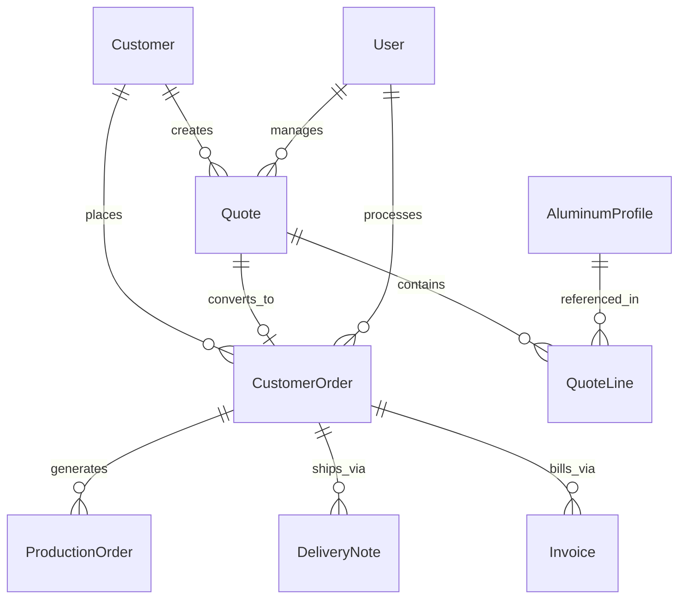

# Data Model: Aluminum Business Module

**Feature**: 002-module-aluminium  
**Date**: 2026-03-04  
**Status**: Complete

---

## Entity Relationship Diagram



---

## Entities

### 1. Customer

**Description**: Customer information for quotes and orders

| Field | Type | Required | Description |
|-------|------|----------|-------------|
| id | UUID | PK | Unique identifier |
| code | VARCHAR(20) | Unique | Internal reference (e.g., "C-00001") |
| companyName | VARCHAR(255) | Yes | Company/legal name |
| contactName | VARCHAR(255) | No | Primary contact person |
| email | VARCHAR(255) | No | Contact email |
| phone | VARCHAR(50) | No | Contact phone |
| billingStreet | VARCHAR(255) | Yes | Billing address street |
| billingCity | VARCHAR(100) | Yes | Billing city |
| billingPostalCode | VARCHAR(20) | Yes | Billing postal code |
| billingCountry | VARCHAR(100) | Yes | Billing country (default: France) |
| shippingStreet | VARCHAR(255) | No | Shipping address street (defaults to billing) |
| shippingCity | VARCHAR(100) | No | Shipping city |
| shippingPostalCode | VARCHAR(20) | No | Shipping postal code |
| shippingCountry | VARCHAR(100) | No | Shipping country |
| paymentTerms | VARCHAR(100) | No | "30 days", "Immediate", etc. |
| vatNumber | VARCHAR(50) | No | EU VAT identification number |
| isActive | BOOLEAN | Yes | Active status (default: true) |
| createdAt | TIMESTAMP | Yes | Creation timestamp |
| updatedAt | TIMESTAMP | Yes | Last update timestamp |

**Indexes**:
- `idx_customer_code` (code) - Unique lookup
- `idx_customer_company` (companyName) - Search
- `idx_customer_active` (isActive) - Filtering

---

### 2. AluminumProfile

**Description**: Aluminum profile catalog with technical specifications

| Field | Type | Required | Description |
|-------|------|----------|-------------|
| id | UUID | PK | Unique identifier |
| reference | VARCHAR(50) | Unique | Profile reference code (e.g., "ALU-PLAT-001") |
| name | VARCHAR(255) | Yes | Display name |
| type | ENUM | Yes | PLAT, TUBE, CORNIERE, UPN, IPE, CUSTOM |
| length | DECIMAL(10,2) | No | Standard length in mm (e.g., 6000) |
| width | DECIMAL(10,2) | No | Width in mm |
| thickness | DECIMAL(10,2) | No | Thickness in mm (for solid profiles) |
| outerWidth | DECIMAL(10,2) | No | Outer width for hollow profiles |
| innerWidth | DECIMAL(10,2) | No | Inner width for hollow profiles |
| outerHeight | DECIMAL(10,2) | No | Outer height for hollow profiles |
| innerHeight | DECIMAL(10,2) | No | Inner height for hollow profiles |
| diameter | DECIMAL(10,2) | No | Diameter for round tubes |
| innerDiameter | DECIMAL(10,2) | No | Inner diameter for round tubes |
| technicalSpecs | TEXT | No | JSON or text with additional specs |
| unitPrice | DECIMAL(12,4) | Yes | Price per kg in EUR |
| weightPerMeter | DECIMAL(10,4) | No | Pre-calculated kg/m (for complex profiles) |
| surfacePerMeter | DECIMAL(10,4) | No | Pre-calculated m²/m (for complex profiles) |
| density | DECIMAL(6,3) | No | Material density (default: 2.700 g/cm³) |
| isActive | BOOLEAN | Yes | Available for new quotes (default: true) |
| createdAt | TIMESTAMP | Yes | Creation timestamp |
| updatedAt | TIMESTAMP | Yes | Last update timestamp |

**Indexes**:
- `idx_profile_reference` (reference) - Unique lookup
- `idx_profile_type` (type) - Filtering
- `idx_profile_active` (isActive) - Filtering

**Business Rules**:
- At least one dimension set must be provided (simple or complex)
- Either provide dimensions for auto-calculation OR weightPerMeter for manual
- Reference format: ALU-{TYPE}-{SEQUENCE}

---

### 3. Quote

**Description**: Sales quote with full calculation and workflow tracking

| Field | Type | Required | Description |
|-------|------|----------|-------------|
| id | UUID | PK | Unique identifier |
| quoteNumber | VARCHAR(50) | Unique | Display number (e.g., "D-2024-00001") |
| customerId | UUID | FK | Reference to Customer |
| commercialId | UUID | FK | Reference to User (sales rep) |
| status | ENUM | Yes | BROUILLON, ENVOYÉ, ACCEPTÉ, REFUSÉ, EXPIRÉ, ANNULÉ, ARCHIVÉ |
| subtotal | DECIMAL(15,4) | Yes | Sum of line totals (before global discount) |
| discountPercent | DECIMAL(5,2) | No | Global discount percentage (default: 0) |
| discountAmount | DECIMAL(15,4) | No | Calculated global discount amount |
| vatRate | DECIMAL(5,2) | Yes | VAT rate percentage (default: 20.00) |
| vatAmount | DECIMAL(15,4) | Yes | Calculated VAT amount |
| total | DECIMAL(15,4) | Yes | Final total after discounts and VAT |
| validUntil | DATE | Yes | Quote validity date (default: +30 days) |
| notes | TEXT | No | Internal notes |
| customerNotes | TEXT | No | Notes to display on PDF |
| sentAt | TIMESTAMP | No | When quote was sent to customer |
| acceptedAt | TIMESTAMP | No | When quote was accepted |
| expiredAt | TIMESTAMP | No | When quote expired |
| convertedToOrderId | UUID | FK | Reference to CustomerOrder (if converted) |
| createdAt | TIMESTAMP | Yes | Creation timestamp |
| updatedAt | TIMESTAMP | Yes | Last update timestamp |

**Indexes**:
- `idx_quote_number` (quoteNumber) - Unique lookup
- `idx_quote_customer` (customerId) - Join optimization
- `idx_quote_commercial` (commercialId) - Filtering by rep
- `idx_quote_status` (status) - Workflow filtering
- `idx_quote_dates` (validUntil, createdAt) - Date range queries

**State Transitions**:
```
BROUILLON → ENVOYÉ, ANNULÉ
ENVOYÉ → ACCEPTÉ, REFUSÉ, EXPIRÉ
ACCEPTÉ → COMMANDE (creates CustomerOrder)
REFUSÉ, EXPIRÉ, ANNULÉ → ARCHIVÉ
```

---

### 4. QuoteLine

**Description**: Individual line items within a quote

| Field | Type | Required | Description |
|-------|------|----------|-------------|
| id | UUID | PK | Unique identifier |
| quoteId | UUID | FK | Reference to Quote |
| profileId | UUID | FK | Reference to AluminumProfile |
| quantity | INTEGER | Yes | Number of pieces |
| unitLength | DECIMAL(10,2) | Yes | Length per piece in mm |
| unitWeight | DECIMAL(10,4) | Yes | Weight per piece in kg |
| totalWeight | DECIMAL(12,4) | Yes | Total weight (quantity × unitWeight) |
| unitSurface | DECIMAL(10,4) | No | Surface area per piece in m² |
| totalSurface | DECIMAL(12,4) | No | Total surface (quantity × unitSurface) |
| materialCost | DECIMAL(12,4) | Yes | Material cost per piece |
| unitPrice | DECIMAL(12,4) | Yes | Selling price per piece |
| lineDiscount | DECIMAL(12,4) | No | Line-level discount amount |
| lineTotal | DECIMAL(15,4) | Yes | Total for line ((unitPrice × quantity) - discount) |
| description | VARCHAR(500) | No | Custom description (overrides profile name) |
| sortOrder | INTEGER | Yes | Display order within quote |
| createdAt | TIMESTAMP | Yes | Creation timestamp |
| updatedAt | TIMESTAMP | Yes | Last update timestamp |

**Indexes**:
- `idx_quoteline_quote` (quoteId) - Join optimization
- `idx_quoteline_profile` (profileId) - Join optimization
- `idx_quoteline_sort` (quoteId, sortOrder) - Ordering

**Calculated Fields**:
- `totalWeight` = quantity × unitWeight
- `totalSurface` = quantity × unitSurface (if applicable)
- `lineTotal` = (unitPrice × quantity) - lineDiscount

---

### 5. CustomerOrder

**Description**: Confirmed customer order linked to quote

| Field | Type | Required | Description |
|-------|------|----------|-------------|
| id | UUID | PK | Unique identifier |
| orderNumber | VARCHAR(50) | Unique | Display number (e.g., "CMD-2024-00001") |
| quoteId | UUID | FK | Reference to Quote (source) |
| customerId | UUID | FK | Reference to Customer |
| commercialId | UUID | FK | Reference to User (sales rep) |
| status | ENUM | Yes | EN_ATTENTE, CONFIRMÉE, EN_PRODUCTION, PARTIELLE, TERMINÉE, LIVRÉE, FACTURÉE, ANNULÉE |
| subtotal | DECIMAL(15,4) | Yes | Carried from quote |
| discountAmount | DECIMAL(15,4) | Yes | Carried from quote |
| vatAmount | DECIMAL(15,4) | Yes | Carried from quote |
| total | DECIMAL(15,4) | Yes | Carried from quote |
| deliveryDate | DATE | No | Requested delivery date |
| actualDeliveryDate | DATE | No | Actual delivery completion date |
| notes | TEXT | No | Order notes |
| confirmedAt | TIMESTAMP | No | When order was confirmed |
| completedAt | TIMESTAMP | No | When order was completed |
| createdAt | TIMESTAMP | Yes | Creation timestamp |
| updatedAt | TIMESTAMP | Yes | Last update timestamp |

**Indexes**:
- `idx_order_number` (orderNumber) - Unique lookup
- `idx_order_quote` (quoteId) - One-to-one lookup
- `idx_order_customer` (customerId) - Join optimization
- `idx_order_status` (status) - Workflow filtering
- `idx_order_delivery` (deliveryDate) - Planning queries

---

### 6. ProductionOrder

**Description**: Manufacturing order linked to customer order

| Field | Type | Required | Description |
|-------|------|----------|-------------|
| id | UUID | PK | Unique identifier |
| productionNumber | VARCHAR(50) | Unique | Display number (e.g., "FAB-2024-00001") |
| customerOrderId | UUID | FK | Reference to CustomerOrder |
| status | ENUM | Yes | PLANIFIÉ, EN_COURS, EN_PAUSE, TERMINÉ, ANNULÉ |
| priority | ENUM | No | BASSE, NORMALE, HAUTE, URGENTE |
| plannedStart | TIMESTAMP | No | Planned start date/time |
| plannedEnd | TIMESTAMP | No | Planned end date/time |
| actualStart | TIMESTAMP | No | Actual start timestamp |
| actualEnd | TIMESTAMP | No | Actual completion timestamp |
| notes | TEXT | No | Production notes |
| createdBy | UUID | FK | Reference to User (production manager) |
| createdAt | TIMESTAMP | Yes | Creation timestamp |
| updatedAt | TIMESTAMP | Yes | Last update timestamp |

**Indexes**:
- `idx_production_number` (productionNumber) - Unique lookup
- `idx_production_order` (customerOrderId) - Join optimization
- `idx_production_status` (status) - Workflow filtering
- `idx_production_dates` (plannedStart, plannedEnd) - Scheduling

---

### 7. ProductionOrderLine

**Description**: Individual items within a production order

| Field | Type | Required | Description |
|-------|------|----------|-------------|
| id | UUID | PK | Unique identifier |
| productionOrderId | UUID | FK | Reference to ProductionOrder |
| profileId | UUID | FK | Reference to AluminumProfile |
| quantityRequired | INTEGER | Yes | Quantity to produce |
| quantityProduced | INTEGER | No | Quantity actually produced |
| length | DECIMAL(10,2) | Yes | Length per piece in mm |
| notes | TEXT | No | Line-specific notes |
| createdAt | TIMESTAMP | Yes | Creation timestamp |
| updatedAt | TIMESTAMP | Yes | Last update timestamp |

**Indexes**:
- `idx_productionline_order` (productionOrderId) - Join optimization
- `idx_productionline_profile` (profileId) - Join optimization

---

### 8. DeliveryNote

**Description**: Delivery/shipment documentation

| Field | Type | Required | Description |
|-------|------|----------|-------------|
| id | UUID | PK | Unique identifier |
| deliveryNumber | VARCHAR(50) | Unique | Display number (e.g., "BL-2024-00001") |
| customerOrderId | UUID | FK | Reference to CustomerOrder |
| status | ENUM | Yes | PRÉPARÉ, EXPÉDIÉ, LIVRÉ, RETOURNÉ |
| deliveryDate | DATE | Yes | Delivery date |
| driverName | VARCHAR(255) | No | Driver/delivery person name |
| vehiclePlate | VARCHAR(50) | No | Vehicle license plate |
| signedBy | VARCHAR(255) | No | Recipient name who signed |
| signedAt | TIMESTAMP | No | When delivery was signed for |
| signatureImage | TEXT | No | Base64 encoded signature image |
| notes | TEXT | No | Delivery notes |
| createdAt | TIMESTAMP | Yes | Creation timestamp |
| updatedAt | TIMESTAMP | Yes | Last update timestamp |

**Indexes**:
- `idx_delivery_number` (deliveryNumber) - Unique lookup
- `idx_delivery_order` (customerOrderId) - Join optimization
- `idx_delivery_status` (status) - Workflow filtering
- `idx_delivery_date` (deliveryDate) - Date range queries

---

### 9. DeliveryNoteLine

**Description**: Individual items within a delivery

| Field | Type | Required | Description |
|-------|------|----------|-------------|
| id | UUID | PK | Unique identifier |
| deliveryNoteId | UUID | FK | Reference to DeliveryNote |
| profileId | UUID | FK | Reference to AluminumProfile |
| quantity | INTEGER | Yes | Quantity delivered |
| length | DECIMAL(10,2) | Yes | Length per piece in mm |
| description | VARCHAR(500) | No | Description override |
| createdAt | TIMESTAMP | Yes | Creation timestamp |

**Indexes**:
- `idx_deliveryline_note` (deliveryNoteId) - Join optimization

---

### 10. Invoice

**Description**: Customer invoice linked to order

| Field | Type | Required | Description |
|-------|------|----------|-------------|
| id | UUID | PK | Unique identifier |
| invoiceNumber | VARCHAR(50) | Unique | Display number (e.g., "FAC-2024-00001") |
| customerOrderId | UUID | FK | Reference to CustomerOrder |
| status | ENUM | Yes | BROUILLON, ENVOYÉE, PAYÉE, EN_RETARD, ANNULÉE |
| issueDate | DATE | Yes | Invoice issue date |
| dueDate | DATE | Yes | Payment due date |
| paidDate | DATE | No | When payment was received |
| subtotal | DECIMAL(15,4) | Yes | Amount before VAT |
| vatAmount | DECIMAL(15,4) | Yes | VAT amount |
| total | DECIMAL(15,4) | Yes | Total amount due |
| amountPaid | DECIMAL(15,4) | No | Amount received (for partial payments) |
| paymentMethod | VARCHAR(50) | No | Virement, Chèque, Espèces, etc. |
| paymentReference | VARCHAR(255) | No | Transaction reference |
| notes | TEXT | No | Invoice notes |
| createdAt | TIMESTAMP | Yes | Creation timestamp |
| updatedAt | TIMESTAMP | Yes | Last update timestamp |

**Indexes**:
- `idx_invoice_number` (invoiceNumber) - Unique lookup
- `idx_invoice_order` (customerOrderId) - Join optimization
- `idx_invoice_status` (status) - Workflow filtering
- `idx_invoice_dates` (issueDate, dueDate) - Date range queries

---

### 11. InvoiceLine

**Description**: Individual line items within an invoice

| Field | Type | Required | Description |
|-------|------|----------|-------------|
| id | UUID | PK | Unique identifier |
| invoiceId | UUID | FK | Reference to Invoice |
| profileId | UUID | FK | Reference to AluminumProfile |
| description | VARCHAR(500) | Yes | Line description |
| quantity | INTEGER | Yes | Quantity |
| unitPrice | DECIMAL(12,4) | Yes | Price per unit |
| lineTotal | DECIMAL(15,4) | Yes | Line total (quantity × unitPrice) |
| createdAt | TIMESTAMP | Yes | Creation timestamp |

**Indexes**:
- `idx_invoiceline_invoice` (invoiceId) - Join optimization

---

## Relationships Summary

| Parent | Child | Type | Cascade |
|--------|-------|------|---------|
| Customer | Quote | 1:N | Restrict |
| Customer | CustomerOrder | 1:N | Restrict |
| Quote | QuoteLine | 1:N | Cascade Delete |
| Quote | CustomerOrder | 1:0..1 | Set Null |
| CustomerOrder | ProductionOrder | 1:N | Cascade Delete |
| CustomerOrder | DeliveryNote | 1:N | Restrict |
| CustomerOrder | Invoice | 1:N | Restrict |
| AluminumProfile | QuoteLine | 1:N | Restrict |
| AluminumProfile | ProductionOrderLine | 1:N | Restrict |
| AluminumProfile | DeliveryNoteLine | 1:N | Restrict |
| AluminumProfile | InvoiceLine | 1:N | Restrict |
| ProductionOrder | ProductionOrderLine | 1:N | Cascade Delete |
| DeliveryNote | DeliveryNoteLine | 1:N | Cascade Delete |
| Invoice | InvoiceLine | 1:N | Cascade Delete |

---

## Constraints & Validation

### AluminumProfile
- Reference must be unique and match pattern `ALU-{TYPE}-{SEQUENCE}`
- At least one dimension set must be provided
- Unit price must be positive
- Density defaults to 2.700 if not specified

### Quote
- Quote number must be unique with format `D-{YYYY}-{SEQUENCE}`
- Valid until date must be in the future on creation
- Status transitions must follow state machine rules
- Total must equal: subtotal - discountAmount + vatAmount

### QuoteLine
- Quantity must be positive
- Unit price must be positive
- Line total must equal: (unitPrice × quantity) - lineDiscount
- Sort order must be unique within quote

### CustomerOrder
- Order number must be unique with format `CMD-{YYYY}-{SEQUENCE}`
- If linked to quote, pricing must match (unless manually overridden)

### Invoice
- Invoice number must be unique with format `FAC-{YYYY}-{SEQUENCE}`
- Due date must be after issue date
- Sequential numbering must not have gaps

---

**Data Model Version**: 1.0.0 | **Last Updated**: 2026-03-04
