# AI Module Workflows

**Module:** 008-ai-module  
**Date:** 2026-03-07  
**Purpose:** Document key workflows and process diagrams for the AI Predictive Module

---

## 1. Demand Forecasting Workflow

### 1.1 Forecast Generation Flow

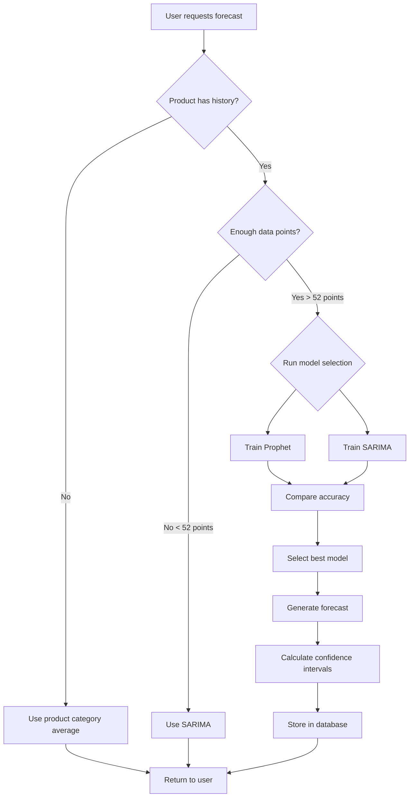

### 1.2 Forecast Retraining Flow

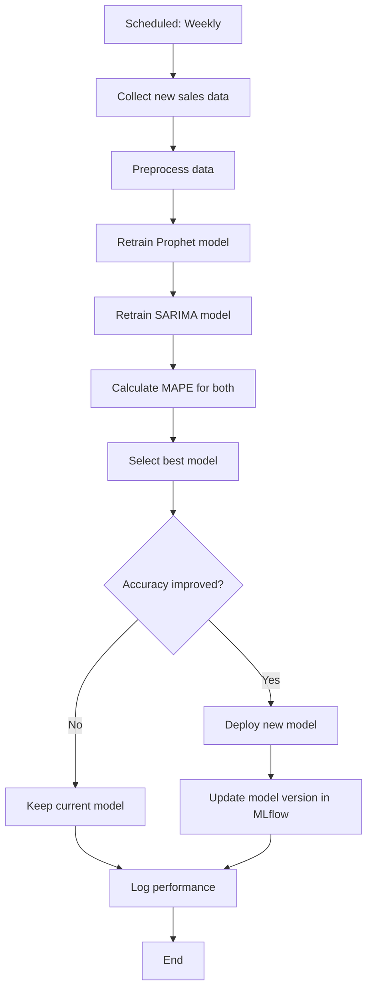

---

## 2. Stockout Prediction Workflow

### 2.1 Stockout Risk Calculation

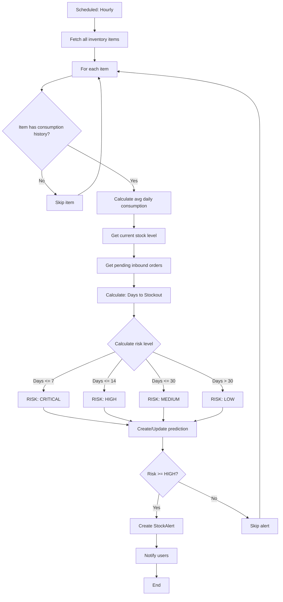

### 2.2 Stockout Alert Workflow

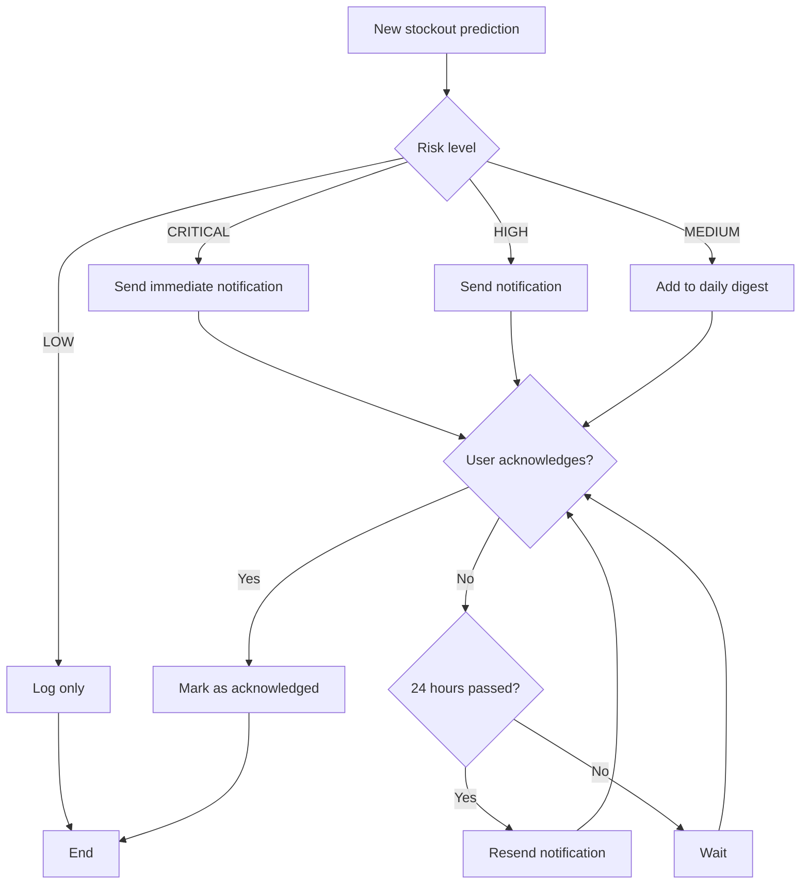

---

## 3. Inventory Optimization Workflow

### 3.1 EOQ Calculation Flow

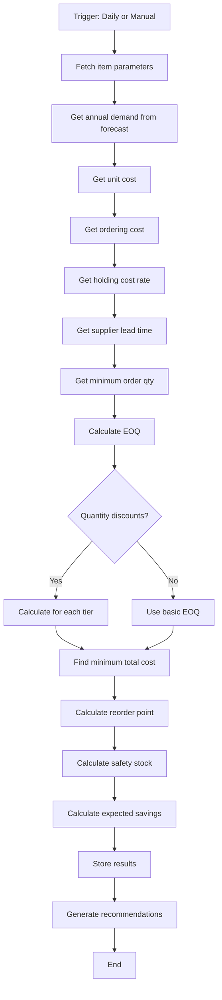

### 3.2 Reorder Recommendation Flow

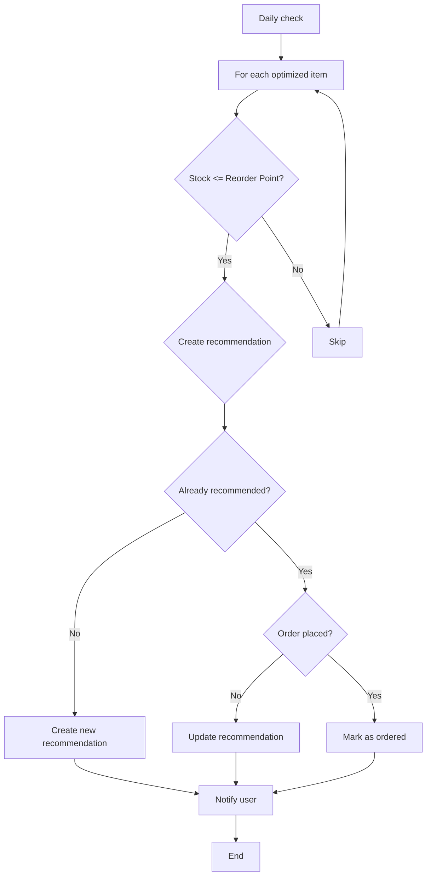

---

## 4. Production Planning Workflow

### 4.1 Schedule Optimization Flow

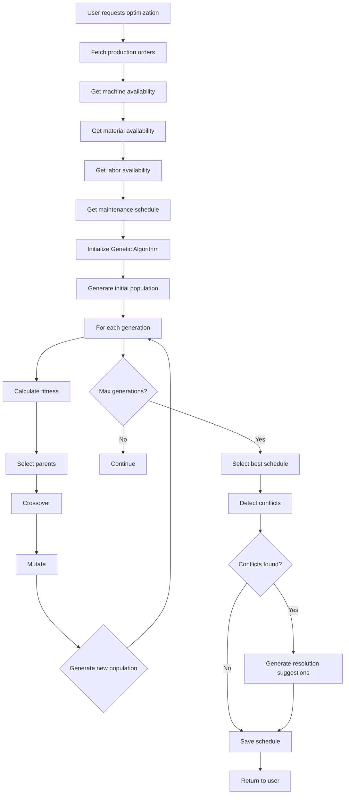

### 4.2 Conflict Detection Flow

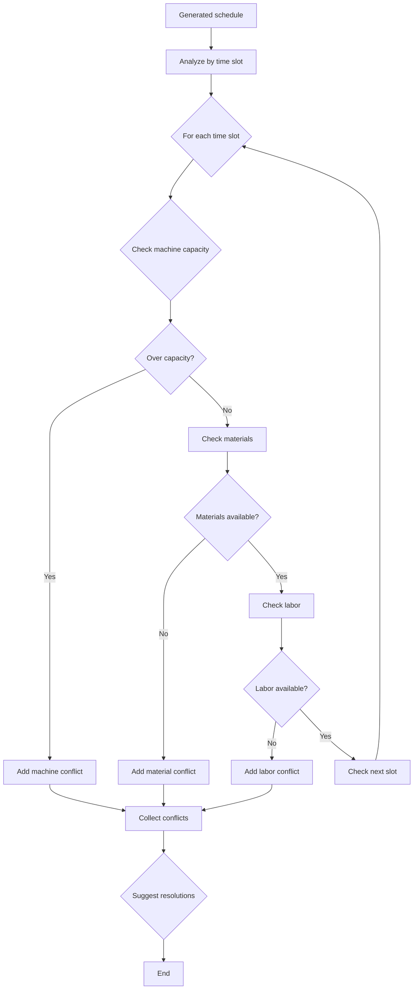

---

## 5. Data Pipeline Workflow

### 5.1 Data Collection Flow

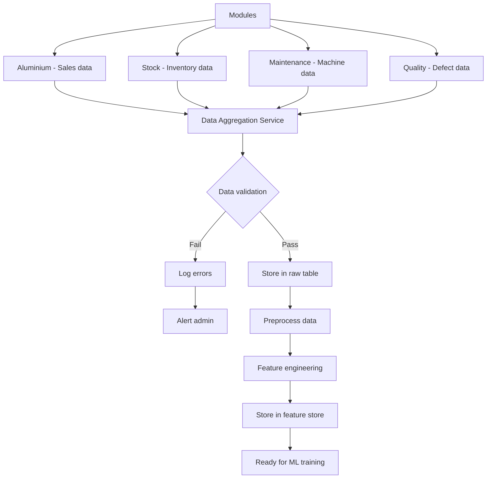

### 5.2 Model Training Flow

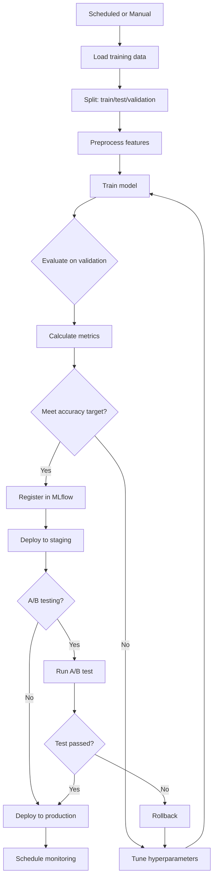

---

## 6. Integration Flows

### 6.1 Event-Driven Updates

```mermaid
flowchart TD
    A[Stock Movement Event] --> B[Update inventory cache]
    B --> C{Type of movement?}
    C -->|OUTBOUND| D[Trigger stockout recalculation]
    C -->|INBOUND| E[Update stock levels]
    
    D --> F[Recalculate for item]
    F --> G{New risk level?}
    G -->|Yes| H[Update prediction]
    G -->No| I[Skip]
    H --> J{Create alert?}
    J -->|Yes| K[Create notification]
    J -->|No| L[End]
    
    E --> L
    I --> L
    K --> L
    
    C -->|INVENTORY_ADJUST| L
```

### 6.2 BI Dashboard Integration

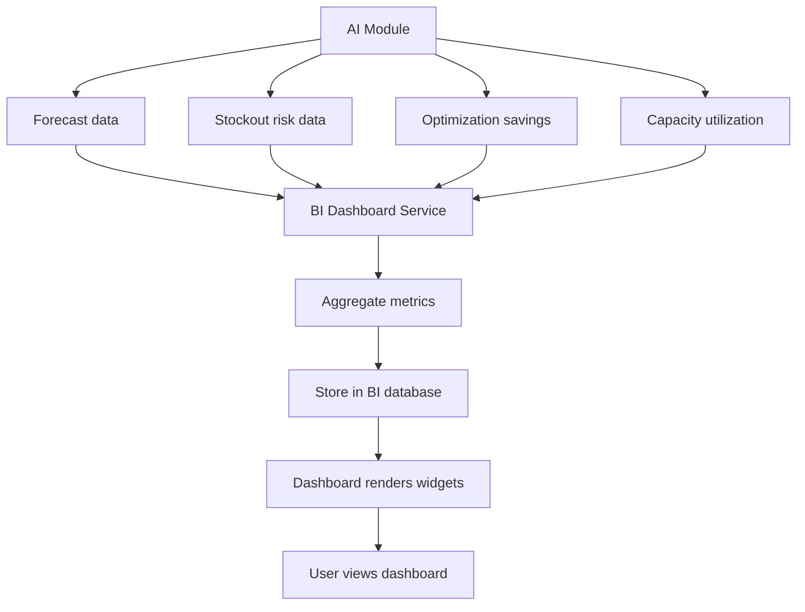

---

## 7. Error Handling Workflows

### 7.1 Model Failure Handling

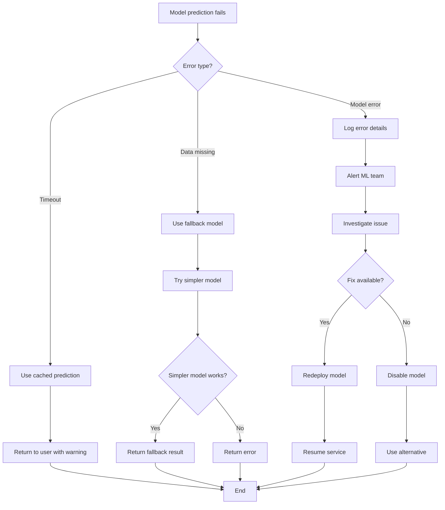

---

*Document Version: 1.0*  
*Created: 2026-03-07*
