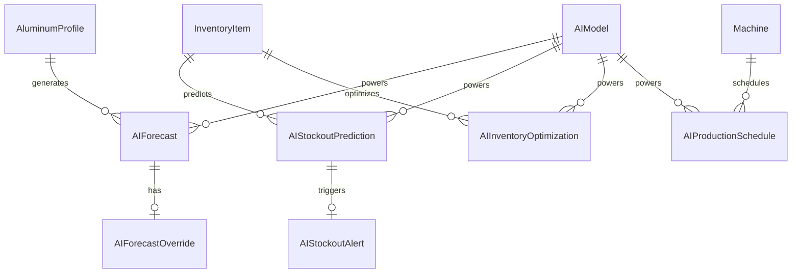

# Data Model: AI Predictive Module

**Module:** 008-ai-module  
**Date:** 2026-03-07  
**Source:** Feature specification entities + integration requirements

---

## 1. Entity Relationship Diagram



---

## 2. Core AI Entities

### 2.1 AIModel

Stores metadata about deployed AI/ML models including version, training data, and performance metrics.

| Field | Type | Constraints | Description |
|-------|------|-------------|-------------|
| id | UUID | PK | Unique identifier |
| name | VARCHAR(100) | NOT NULL | Model name (e.g., "demand_forecast_v1") |
| type | ENUM | NOT NULL | FORECASTING, STOCKOUT, INVENTORY_OPT, PRODUCTION_SCHEDULING |
| algorithm | VARCHAR(50) | NOT NULL | SARIMA, PROPHET, LSTM, EOQ, GENETIC_ALGORITHM |
| version | VARCHAR(20) | NOT NULL | Semantic version (e.g., "1.0.0") |
| status | ENUM | DEFAULT 'TRAINING' | TRAINING, DEPLOYED, ARCHIVED, FAILED |
| hyperparameters | JSONB | NULL | Model-specific parameters |
| trainingDataStart | DATE | NULL | Training data start date |
| trainingDataEnd | DATE | NULL | Training data end date |
| accuracy | DECIMAL(5,4) | NULL | Model accuracy score (0-1) |
| mape | DECIMAL(5,4) | NULL | Mean Absolute Percentage Error |
| rmse | DECIMAL(10,4) | NULL | Root Mean Square Error |
| trainedAt | TIMESTAMP | NULL | Last training timestamp |
| deployedAt | TIMESTAMP | NULL | Deployment timestamp |
| createdAt | TIMESTAMP | DEFAULT NOW() | Creation timestamp |
| updatedAt | TIMESTAMP | AUTO UPDATE | Last modification |

**Indexes:**
- `idx_aimodel_type_status` (type, status)
- `idx_aimodel_name_version` (name, version) - Unique

---

### 2.2 AIForecast

Stores demand forecast predictions generated by forecasting models.

| Field | Type | Constraints | Description |
|-------|------|-------------|-------------|
| id | UUID | PK | Unique identifier |
| modelId | UUID | FK → AIModel | Source model |
| productId | UUID | FK → AluminumProfile | Forecasted product |
| forecastDate | DATE | NOT NULL | Date the forecast was generated |
| targetDate | DATE | NOT NULL | Date being forecasted |
| horizon | INTEGER | NOT NULL | Forecast horizon in weeks (1-52) |
| predictedQuantity | DECIMAL(12,2) | NOT NULL | Predicted quantity |
| confidenceLower | DECIMAL(12,2) | NULL | 95% confidence lower bound |
| confidenceUpper | DECIMAL(12,2) | NULL | 95% confidence upper bound |
| confidenceLower80 | DECIMAL(12,2) | NULL | 80% confidence lower bound |
| confidenceUpper80 | DECIMAL(12,2) | NULL | 80% confidence upper bound |
| isManual | BOOLEAN | DEFAULT FALSE | Whether this is a manual override |
| createdAt | TIMESTAMP | DEFAULT NOW() | Creation timestamp |

**Indexes:**
- `idx_aiforecast_product_horizon` (productId, horizon)
- `idx_aiforecast_target_date` (targetDate)
- `idx_aiforecast_model` (modelId)

**Relationships:**
- Many-to-One: AIForecast → AIModel
- Many-to-One: AIForecast → AluminumProfile

---

### 2.3 AIForecastOverride

Stores manual overrides applied to AI forecasts by users.

| Field | Type | Constraints | Description |
|-------|------|-------------|-------------|
| id | UUID | PK | Unique identifier |
| forecastId | UUID | FK → AIForecast | Original forecast |
| userId | UUID | FK → User | User who made the override |
| originalQuantity | DECIMAL(12,2) | NOT NULL | Original predicted quantity |
| overrideQuantity | DECIMAL(12,2) | NOT NULL | User-specified quantity |
| reason | TEXT | NULL | Justification for override |
| createdAt | TIMESTAMP | DEFAULT NOW() | Creation timestamp |

---

### 2.4 AIStockoutPrediction

Stores stockout risk predictions for inventory items.

| Field | Type | Constraints | Description |
|-------|------|-------------|-------------|
| id | UUID | PK | Unique identifier |
| modelId | UUID | FK → AIModel | Source model |
| inventoryItemId | UUID | FK → InventoryItem | Predicted item |
| predictionDate | DATE | NOT NULL | Date prediction was made |
| currentStock | DECIMAL(12,2) | NOT NULL | Stock level at prediction time |
| predictedConsumption | DECIMAL(12,2) | NOT NULL | Predicted consumption for period |
| pendingIncoming | DECIMAL(12,2) | DEFAULT 0 | Pending incoming stock |
| daysToStockout | INTEGER | NOT NULL | Estimated days until stockout |
| riskLevel | ENUM | NOT NULL | CRITICAL, HIGH, MEDIUM, LOW |
| recommendedReorderQty | DECIMAL(12,2) | NULL | Suggested reorder quantity |
| recommendedReorderDate | DATE | NULL | Suggested reorder date |
| leadTimeDays | INTEGER | NULL | Supplier lead time |
| isAcknowledged | BOOLEAN | DEFAULT FALSE | Whether alert has been acknowledged |
| acknowledgedBy | UUID | FK → User | User who acknowledged |
| acknowledgedAt | TIMESTAMP | NULL | Acknowledgment timestamp |
| createdAt | TIMESTAMP | DEFAULT NOW() | Creation timestamp |

**Indexes:**
- `idx_aistockout_item_date` (inventoryItemId, predictionDate)
- `idx_aistockout_risk_level` (riskLevel)
- `idx_aistockout_prediction_date` (predictionDate)

**Relationships:**
- Many-to-One: AIStockoutPrediction → AIModel
- Many-to-One: AIStockoutPrediction → InventoryItem

---

### 2.5 AIStockoutAlert

Integration with existing StockAlert system for stockout notifications.

| Field | Type | Constraints | Description |
|-------|------|-------------|-------------|
| id | UUID | PK | Unique identifier |
| predictionId | UUID | FK → AIStockoutPrediction | Source prediction |
| alertId | UUID | FK → StockAlert | Linked stock alert |
| createdAt | TIMESTAMP | DEFAULT NOW() | Creation timestamp |

---

### 2.6 AIInventoryOptimization

Stores Economic Order Quantity (EOQ) calculations and optimization results.

| Field | Type | Constraints | Description |
|-------|------|-------------|-------------|
| id | UUID | PK | Unique identifier |
| modelId | UUID | FK → AIModel | Source model |
| inventoryItemId | UUID | FK → InventoryItem | Optimized item |
| calculationDate | DATE | NOT NULL | Date calculation was made |
| currentOrderQty | DECIMAL(12,2) | NOT NULL | Current order quantity |
| eoq | DECIMAL(12,2) | NOT NULL | Economic Order Quantity |
| reorderPoint | DECIMAL(12,2) | NOT NULL | Reorder Point (ROP) |
| safetyStock | DECIMAL(12,2) | NOT NULL | Calculated safety stock |
| minimumOrderQty | DECIMAL(12,2) | NULL | Supplier minimum order quantity |
| annualDemand | DECIMAL(12,2) | NOT NULL | Forecasted annual demand |
| orderingCost | DECIMAL(10,2) | NOT NULL | Cost per order |
| holdingCostRate | DECIMAL(5,4) | NOT NULL | Holding cost as percentage |
| unitCost | DECIMAL(10,4) | NOT NULL | Unit cost of item |
| expectedAnnualSavings | DECIMAL(10,2) | NULL | Expected cost savings |
| orderFrequency | DECIMAL(6,2) | NULL | Orders per year |
| currentAnnualCost | DECIMAL(12,2) | NULL | Current total annual cost |
| optimizedAnnualCost | DECIMAL(12,2) | NULL | Optimized total annual cost |
| createdAt | TIMESTAMP | DEFAULT NOW() | Creation timestamp |

**Indexes:**
- `idx_aiinventory_item` (inventoryItemId)
- `idx_aiinventory_date` (calculationDate)
- `idx_aiinventory_savings` (expectedAnnualSavings)

**Relationships:**
- Many-to-One: AIInventoryOptimization → AIModel
- Many-to-One: AIInventoryOptimization → InventoryItem

---

### 2.7 AIProductionSchedule

Stores optimized production schedules generated by scheduling algorithms.

| Field | Type | Constraints | Description |
|-------|------|-------------|-------------|
| id | UUID | PK | Unique identifier |
| modelId | UUID | FK → AIModel | Source model |
| scheduleDate | DATE | NOT NULL | Date schedule was generated |
| optimizationType | VARCHAR(50) | NOT NULL | SEQUENCE, CAPACITY, CONFLICT_RESOLUTION |
| startDate | DATE | NOT NULL | Schedule start date |
| endDate | DATE | NOT NULL | Schedule end date |
| totalMakespan | DECIMAL(10,2) | NULL | Total schedule duration |
| totalOrders | INTEGER | NOT NULL | Number of orders scheduled |
| conflictsDetected | INTEGER | DEFAULT 0 | Number of conflicts found |
| conflictsResolved | INTEGER | DEFAULT 0 | Number of conflicts resolved |
| generatedSchedule | JSONB | NOT NULL | Optimized schedule data |
| baselineMakespan | DECIMAL(10,2) | NULL | Original makespan for comparison |
| improvementPercent | DECIMAL(5,2) | NULL | Improvement percentage |
| generatedBy | UUID | FK → User | User who triggered optimization |
| createdAt | TIMESTAMP | DEFAULT NOW() | Creation timestamp |

**Indexes:**
- `idx_aiproduction_date` (scheduleDate)
- `idx_aiproduction_type` (optimizationType)

---

### 2.8 AIProductionConflict

Stores detected resource conflicts in production scheduling.

| Field | Type | Constraints | Description |
|-------|------|-------------|-------------|
| id | UUID | PK | Unique identifier |
| scheduleId | UUID | FK → AIProductionSchedule | Parent schedule |
| conflictType | VARCHAR(50) | NOT NULL | MACHINE, MATERIAL, LABOR, DEADLINE |
| severity | ENUM | NOT NULL | CRITICAL, HIGH, MEDIUM |
| resourceType | VARCHAR(50) | NOT NULL | Type of resource |
| resourceId | UUID | NOT NULL | ID of conflicting resource |
| orderIds | JSONB | NOT NULL | Affected order IDs |
| description | TEXT | NOT NULL | Conflict description |
| suggestedResolution | TEXT | NULL | AI-suggested fix |
| isResolved | BOOLEAN | DEFAULT FALSE | Resolution status |
| resolvedBy | UUID | FK → User | Resolver |
| resolvedAt | TIMESTAMP | NULL | Resolution timestamp |
| createdAt | TIMESTAMP | DEFAULT NOW() | Creation timestamp |

---

### 2.9 AITrainingJob

Tracks asynchronous ML training jobs.

| Field | Type | Constraints | Description |
|-------|------|-------------|-------------|
| id | UUID | PK | Unique identifier |
| modelId | UUID | FK → AIModel | Model being trained |
| status | ENUM | DEFAULT 'QUEUED' | QUEUED, RUNNING, COMPLETED, FAILED |
| jobType | VARCHAR(50) | NOT NULL | FULL_RETRAIN, INCREMENTAL, HYPERPARAM_TUNING |
| startedAt | TIMESTAMP | NULL | Job start time |
| completedAt | TIMESTAMP | NULL | Job completion time |
| errorMessage | TEXT | NULL | Error details if failed |
| progress | INTEGER | DEFAULT 0 | Progress percentage (0-100) |
| createdAt | TIMESTAMP | DEFAULT NOW() | Creation timestamp |

---

## 3. Integration with Existing Entities

### 3.1 Relationship to Stock Module

```
InventoryItem
  ├── AIStockoutPrediction (1:N) - Stockout predictions over time
  └── AIInventoryOptimization (1:N) - Optimization results over time
```

### 3.2 Relationship to Aluminium Module

```
AluminumProfile
  └── AIForecast (1:N) - Forecasts for each period
```

### 3.3 Relationship to Maintenance Module

```
Machine
  └── AIProductionSchedule (1:N) - Production schedules considering machine availability
```

---

## 4. Time-Series Extensions

### 4.1 Hypertables (TimescaleDB)

For optimal time-series query performance, the following tables should be hypertables:

- `AIForecast` - Partitioned by `targetDate`
- `AIStockoutPrediction` - Partitioned by `predictionDate`
- `AIInventoryOptimization` - Partitioned by `calculationDate`
- `AIProductionSchedule` - Partitioned by `scheduleDate`

---

## 5. Data Retention

| Table | Retention Period | Justification |
|-------|-----------------|---------------|
| AIForecast | 36 months | Historical accuracy analysis |
| AIStockoutPrediction | 12 months | Alert history |
| AIInventoryOptimization | 24 months | Optimization history |
| AIProductionSchedule | 6 months | Recent schedules |
| AITrainingJob | 12 months | Audit trail |

---

## 6. API Response DTOs

### 6.1 ForecastDTO

```typescript
interface ForecastDTO {
  id: string;
  productId: string;
  productName: string;
  targetDate: string;
  horizon: number;
  predictedQuantity: number;
  confidence95: { lower: number; upper: number };
  confidence80: { lower: number; upper: number };
  trend: 'INCREASING' | 'STABLE' | 'DECREASING';
  isManual: boolean;
  accuracy?: number;
}
```

### 6.2 StockoutRiskDTO

```typescript
interface StockoutRiskDTO {
  id: string;
  inventoryItemId: string;
  productReference: string;
  currentStock: number;
  daysToStockout: number;
  riskLevel: 'CRITICAL' | 'HIGH' | 'MEDIUM' | 'LOW';
  recommendedReorderQty: number;
  recommendedReorderDate: string;
  isAcknowledged: boolean;
}
```

### 6.3 OptimizationResultDTO

```typescript
interface OptimizationResultDTO {
  id: string;
  inventoryItemId: string;
  productReference: string;
  currentOrderQty: number;
  eoq: number;
  reorderPoint: number;
  safetyStock: number;
  expectedAnnualSavings: number;
  improvementPercent: number;
  orderFrequency: number;
}
```

---

*Document Version: 1.0*  
*Created: 2026-03-07*
